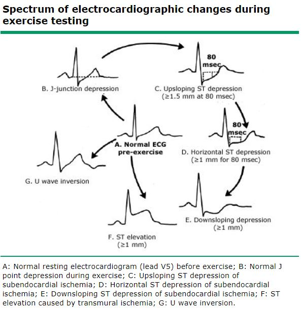

$$~$$

<center>{width=40%}</center>

<center> The Final Project </center>

$$~$$

<center> Author $\rightarrow$ Jeremy Sapienza 1960498 </center>

<center> <i> Statistics for Data Science and Laboratory II </i> </center>
<center> <b> Sapienza University of Rome</b> </center>
<center> July 21th 2021 </center>

$$~$$ 

<center> <b> <font size="6"> Guessing, if there is a Heart Attack or not </font> </b> </center>

$$~$$ 

```{r setup, include=FALSE}
knitr::opts_chunk$set(echo = TRUE)
knitr::opts_chunk$set(cache = TRUE)

require(tidyverse)
require(magrittr)
require(R2jags)
require(bayesplot)
require(TeachingDemos)
require(factoextra)
require(highcharter)
require(dplyr)

# loading the categeories
load_cat <- function(frame) {
  sorted_df <- frame %>%
              drop_na() %>%
              dplyr::summarise(Count = n()) %>%
              dplyr::arrange(desc(Count)) %>%
              dplyr::mutate(percentage = paste0(round(Count / sum(Count) * 100, 1), "%"))
    
    return(sorted_df)
}

# getting the histograms and the relative summaries, using meanwhile hchart for plotting the hists
hist.and.summary <- function(variable, main.title){
  print(summary(dat[[variable]])) 
  hchart(dat[[variable]], type = "column", name = variable, color = randomcoloR::randomColor()) %>%
    hc_title(text = main.title) %>%
    hc_xAxis(title = variable) %>%
    hc_chart(options3d=list(enabled=TRUE, alpha=2, beta=-10, 
                              depth=100, viewDistance=25)) %>% 
    hc_plotOptions(column=list(depth= 100))
}

dense.chart <- function(name, title){ # Showing the density considering the two cases of having an heart attack or not
  frame <- dat[ , (names(dat) %in% c(name, 'output'))] # select the interested rows

  # sub select the two categories
  normal <- frame %>% filter(output == 0)
  heart_attack <- frame %>% filter(output == 1)

  hchart( density(unlist(normal[, name])), type = "area", color = randomcoloR::randomColor(), name = "Normal") %>%
      hc_add_series( density(unlist(heart_attack[, name])), type = "area", color = randomcoloR::randomColor(), name = "Heart Attack") %>%
        hc_title(text= title) %>%
          hc_xAxis(title = name)
}
```

```{r set_seed, echo=FALSE}
set.seed(123)
```


$$~$$

<center></center>

$$~$$

- <a href="#intro"> The Introduction </a>
    + <a href="#thedataset"> The Dataset </a> 
    + <a href="#dvs"> The Data Visualization </a>
        + <a href="#pca"> The Visualization Using PCA </a>
        + <a href="#tcd"> The Categorical Data </a>
        + <a href="#tqd"> The Quantitative Data </a>
        + <a href="#tc"> The Correlations </a>
- <a href="#pbd"> Preliminary Brief Definitions </a>
- <a href="#thegoal"> The Goal (+ Cheating And Using The Frequentistic Logistic Regression Approach) </a>
    + <a href="#tfm"> The First Model (Link Function With logit) </a>
        + <a href="#ir"> Implementing RJags </a>
        + <a href="#tsr"> The Stationary Regions </a>
        + <a href="#soip"> Some Other Interesting Plots </a>
        + <a href="#tcm"> The Cumulative Means </a>
        + <a href="#tae"> The Approximation Error </a>
        + <a href="#pu"> Posterior Uncertainty </a>
        + <a href="#tcest"> The Estimated Correlations </a>
    + <a href="#htmc"> Hypotheses And Testing Of The Convergences Of These Multiple Markov Chains </a>
        + <a href="#raftery"> Raftery & Lewis Test </a>
        + <a href="#geweke"> Geweke Test </a>
        + <a href="#gelman"> Gelman Test </a>
        + <a href="#ht"> Heidel Test </a>
    + <a href="#cia"> Credible Interval And The Point Estimates </a>
    + <a href="#tp"> The Predictions </a>
- <a href="#tsm"> The Second Model </a>
    + <a href="#dic"> The Comparison Between These Two Models (DIC) </a>
        + <a href="#aic"> Akaike Information Criterion (AIC) </a>
        + <a href="#bic"> Bayesian Information Criterion (BIC) </a>
        + <a href="#comparedallcriteria"> Comparing DIC, AIC, BIC </a>
- <a href="#conclusions"> The Conclusions </a>
    + <a href="#simulatedata"> Parameters Recovery Simulations </a>
    + <a href="#furtherwork"> Further Work </a>
    + <a href="#finalconclusions"> ...Final Conclusions </a>
    + <a href="#thereferences"> The References </a>

$$~$$

# <a id="intro"> The Introduction </a>

$$~$$

Nowadays, with the improvement of the technologies there are an amount of data that allows us to understand if there is any problem or not in the healthy of a person.

Here in this project we explain and we try to predict whether a patient should be diagnosed with Heart Disease or not.

$$~$$

## <a id="thedataset"> The Dataset </a>

$$~$$

<center>{width=40%}</center>

$$~$$

Kaggle, is the main platform where I found this interesting dataset where applying our main bayesian inference as the main scope of this project.

This dataset is composed by these features:

```{r echo=FALSE, warning=FALSE}
dat <- read_csv("heart.csv")
dat <- unique(dat) # remove any duplicate presents
head(dat)
```

$$~$$

Analyzing these features, we captured some interesting information for each feature within the dataset:

<style>
ol ul {
    margin-bottom: 10px;
}
</style>

1. ***Age*** -> it refers to the age of the patient
2. ***sex*** -> it refers if the patient is:
    + male (1)
    + female (0)
3. ***cp*** -> it refers to the chest pain type that could be of four types:
    + 0 is the typical angina
    + 1 is the atypical angina
    + 2 is the non-anginal pain
    + 3 is the asymptomatic type
4. ***trestbps*** -> it refers to the resting blood pressure
5. ***chol*** -> it refers to the serum cholesterol in mg/dl
6. ***fbs*** -> it refers to the fasting blood sugar that if it is larger than 120 mg/dl is represented with:
    + 1 (true)
    + 0 (false)
7. ***restecg*** -> it refers to the resting electrocardiographic results: 
    + 0 as Normal
    + 1 having ST-T wave abnormality (T wave inversions and/or ST elevation or depression of > 0.05 mV)
    + 2 showing probable or definite left ventricular hypertrophy by Estes' criteria
8. ***thalachh*** -> it refers to the maximum heart rate achieved
9. ***exng*** -> it refers to the exercise induced angina that could be:
    + 1 (yes)
    + 0 (no)
10. ***oldpeak*** -> it refers to the previous peak
11. ***slp*** -> it refers to the peak exercise ST segment: 
    + 0 as up sloping
    + 1 as flat
    + 2 as down sloping
12. ***caa*** -> it refers to the number of major vessels that goes from 0 to 3
13. ***thall*** -> it refers to the diagnostic maximum heart rate achieved: 
    + 0 as no-data 
    + 1 as normal
    + 2 as fixed defect
    + 3 as reversible defect
14. ***output*** -> it refers to the fact to have the heart attack or not

$$~$$

As we can see above, we have qualitative and quantitative data that will be well explained in the next subchapters.

The main features detected have these summaries: 

$$~$$

```{r echo=FALSE}
summary(dat)
```

$$~$$
As we can see above: 

1. The people captured in this dataset represents ***people between 29 and 77 years***, so it is evident that there aren't teenagers in this dataset. Because, there is a low probability that the teenagers have the heart attack.
2. The ***genders*** in this dataset are ***equally distributed*** between females and males.
3. The ***output*** feature is ***equally distributed*** between people that have a heart attack and not.

...Behaviours of the other features within the dataset could be seen in this summary, so let's go to the data visualization for having a good visualizations of which data we are treating!

$$~$$

## <a id="dvs"> The Data Visualization </a>

$$~$$

In this subsection we want to describe graphically the dataset that we are analyzing to have a first taste of what is the better model to use in this case, we want to show below some interesting plots.

$$~$$

### <a id="pca"> The Visualization Using PCA </a>

$$~$$

PCA is a particular (visualization, sometimes) tool that allows us to show the patients similar each other. Essentially, the principal component analysis (PCA) is the process of computing the principal components and using them to perform a change of basis on the data, sometimes using only the first few principal components and ignoring the rest. Also PCA is used in exploratory data analysis and for making predictive models. It is commonly used for dimensionality reduction by projecting each data point onto only the first few principal components to obtain lower-dimensional data while preserving as much of the data's variation as possible.

$$~$$

```{r echo=FALSE, fig.align="center"}
# for visualization
res.pca <- prcomp(dat, scale = FALSE) # compute PCA

# patients  with a similar profile are grouped together
fviz_pca_ind(res.pca,
             col.ind = "cos2", # Color by the quality of representation
             gradient.cols = c("#00AFBB", "#E7B800", "#FC4E07"),
             repel =FALSE,     # Avoid text overlapping
             label=FALSE
)

fviz_eig(res.pca) # Show the percentage of variances explained by each principal component
```

$$~$$

Its normal to denote that there could be some losses on this representation due to the amount of features that we want to consider, but here we actually recover ***89.8%*** of variance in the entire dataset using two principal components, so this is a good preservation of the result. 

$$~$$

## <a id="tcd"> The Categorical Data </a>

$$~$$

Here, we want to analyze the percentages of each categorical data:

$$~$$

```{r echo=FALSE}
get_cp_str <- function(bool_var){ # get the type of chest pain
  char_list <- c(1, length(bool_var))
  for (i in 1:length(bool_var)) {
    var <- bool_var[i]
    new_char <- 'unknown'  
    
    if(var == 0){
        new_char <- 'typical angina'
    }
      
    if(var == 1){
        new_char <- 'atypical angina'
    }
      
    if(var == 2){
        new_char <- 'non-anginal pain'
    }
      
    if(var == 3){
        new_char <- 'asymptomatic'
    }
      
     char_list[i] <-  new_char
   }
    
    return(char_list)
 }

# extract for each type of chest pain the relative percentage
cp_dat <- dat %>% 
    dplyr::select(cp) %>%
    dplyr::group_by(cp) %>%
    dplyr::summarise(Count = n()) %>%
    dplyr::arrange(desc(Count)) %>%
    dplyr::mutate(
        cp_str = get_cp_str(cp),
        percentage = paste0(round(Count / sum(Count) * 100, 1), "%")
    )

# plotting the cp_dat
cp_dat %>%
  hchart(type = "pie", hcaes(x = paste(cp_str, ' \t(', percentage, ')' ), y = Count)) %>%
    hc_xAxis(title = 'Chest Pain', categories = paste(cp_dat$cp_str, ' (', cp_dat$percentage, ')' )) %>%
    hc_title(text = 'Chest Pain') %>%
    hc_add_theme(hc_theme_google()) %>%
    hc_chart(options3d=list(enabled=TRUE, alpha=45, beta=0)) %>% 
    hc_plotOptions(pie=list(innerSize= 100, 
                            depth= 45))
```

The most relevant is the ***typical angina (47.4%)*** that is defined as substernal chest pain precipitated by physical exertion or emotional stress and relieved with rest or nitroglycerin (represents a particular decrease of flow of the blood and oxygen to the heart, in order to relax the patient. This allows to pass well the blood within the body's patient). 

Women and elderly patients are usually have atypical symptoms both at rest and during stress, often in the setting of nonobstructive coronary artery disease (CAD).

$$~$$
 
```{r echo=FALSE}
get_string <- function(bool_var){ # get the type of fbs
  char_list <- c(1, length(bool_var))
  for (i in 1:length(bool_var)) {
    var <- bool_var[i]
    new_char <- 'unknown'  
    
    if(var == 1){
        new_char <- 'prediabetes (fbs > 120 mg/d)'
    }
    else{
        new_char <- 'normal'
     }
      
     char_list[i] <-  new_char
   }
    
    return(char_list)
 }

# creating the dataframe for using it in the next lines of code
fbs_dat <- dat %>% 
    dplyr::select(fbs) %>%
    dplyr::group_by(fbs) %>%
    dplyr::summarise(Count = n()) %>%
    dplyr::arrange(desc(Count)) %>%
    dplyr::mutate(
        fbs_str = get_string(fbs),
        percentage = paste0(round(Count / sum(Count) * 100, 1), "%")
    )

# plotting the dataframe obtained before
fbs_dat %>%
  hchart(type = "pie", hcaes(x = paste(fbs_str, ' \t(', percentage, ')' ), y = Count)) %>%
    hc_xAxis(title = 'fasting blood sugar', categories = paste(get_string(fbs_dat$fbs_str), ' (', fbs_dat$percentage, ')' )) %>%
    hc_title(text = 'Fasting Blood Sugar') %>%
    hc_add_theme(hc_theme_google()) %>%
    hc_chart(options3d=list(enabled=TRUE, alpha=45)) %>% 
    hc_plotOptions(pie=list(innerSize= 100, 
                            depth= 45))
```

```{r echo=FALSE}
get_restecg_str <- function(bool_var){ # get the restecg
  char_list <- c(1, length(bool_var))
  for (i in 1:length(bool_var)) {
    var <- bool_var[i]
    new_char <- 'unknown'  
    
    if(var == 0){
        new_char <- 'Normal'
    }
    if(var == 1){
        new_char <- 'lvl 1, having ST-T wave abnormality (T wave inversions and/or ST elevation or depression of > 0.05 mV)'
    }
    if(var == 2){
        new_char <- "lvl 2, showing probable or definite left ventricular hypertrophy by Estes' criteria"
     }
      
     char_list[i] <-  new_char
   }
    
    return(char_list)
 }

# creating the dataframe for using it in the next lines of code
restecg_dat <- dat %>% 
    dplyr::select(restecg) %>%
    dplyr::group_by(restecg) %>%
    dplyr::summarise(Count = n()) %>%
    dplyr::arrange(desc(Count)) %>%
    dplyr::mutate(
        restecg_str = get_restecg_str(restecg),
        percentage = paste0(round(Count / sum(Count) * 100, 1), "%")
    )

# using the dataframe to plot it
restecg_dat %>%
  hchart(type = "pie", hcaes(x = paste(restecg_str, ' \t(', percentage, ')' ), y = Count)) %>%
    hc_xAxis(title = 'restecg', categories = paste(restecg_dat$restecg_str, ' (', restecg_dat$percentage, ')' )) %>%
    hc_title(text = 'Resting Electrocardiographic Results') %>%
    hc_add_theme(hc_theme_google()) %>%
    hc_chart(options3d=list(enabled=TRUE, alpha=45)) %>% 
    hc_plotOptions(pie=list(innerSize= 100, 
                            depth= 45))
```

```{r echo=FALSE}
# creating the dataframe for using it in the next lines of code
slp_dat <- load_cat( 
              dat %>%
               dplyr::select(slp) %>%
               dplyr::group_by(slp)
             )

# using the dataframe
slp_dat %>%
  hchart(type = "pie", hcaes(x = paste(slp, ' \t(', percentage, ')' ), y = Count)) %>%
    hc_xAxis(title = 'Slope', categories = paste(slp_dat$slp, ' (', slp_dat$percentage, ')' )) %>%
    hc_title(text = 'Slope') %>%
    hc_add_theme(hc_theme_google()) %>%
    hc_chart(options3d=list(enabled=TRUE, alpha=45)) %>% 
    hc_plotOptions(pie=list(innerSize= 100, 
                            depth= 45))
    
```

{width=25%; align=RIGHT}

the ST/heart rate slope (ST/HR slope), is proposed as a more accurate ECG criterion for diagnosing significant coronary artery disease (CAD).

The most relevant rate slope is approximately between the first and second type (as ***flat*** and as ***down sloping***) these are qualitative data that show how it is the type of heart rate frequence. 

$$~$$

```{r echo=FALSE}
# creating the dataframe for using it in the next lines of code
caa_dat <- load_cat(
              dat %>%
               dplyr::select(caa) %>%
               dplyr::group_by(caa)
             )

# using the dataframe for plotting it
caa_dat %>%
  hchart(type = "pie", hcaes(x = paste(caa, ' \t(', percentage, ')' ), y = Count)) %>%
    hc_xAxis(title = 'caa', categories = paste(caa_dat$caa, ' (', caa_dat$percentage, ')' )) %>%
    hc_title(text = 'Number of Major Vessels (0-4)') %>%
    hc_add_theme(hc_theme_google()) %>%
    hc_chart(options3d=list(enabled=TRUE, alpha=45)) %>% 
    hc_plotOptions(pie=list(innerSize= 100, 
                            depth= 45))

```

The most case is 0 major vessels interested, this means that they aren't effect of any damaged. In other little case we can see that few vessels are damaged (around 1-2 vessels).

$$~$$

```{r echo=FALSE}
# creating the dataframe for using it in the next lines of code
thall_dat <- load_cat(
              dat %>%
               dplyr::select(thall) %>%
               dplyr::group_by(thall)
             )

# using the dataframe to plot it
thall_dat %>%
  hchart(type = "pie", hcaes(x = paste(thall, ' \t(', percentage, ')' ), y = Count)) %>%
    hc_xAxis(title = 'Thall', categories = paste(thall_dat$thall, ' (', thall_dat$percentage, ')' )) %>%
    hc_title(text = 'Thall') %>%
    hc_add_theme(hc_theme_google()) %>%
    hc_chart(options3d=list(enabled=TRUE, alpha=45)) %>% 
    hc_plotOptions(pie=list(innerSize= 100, 
                            depth= 45))

```

the maximum rate achieved is about a fixed defect.

$$~$$

```{r echo=FALSE}
make_string <- function(bool_var){ # get the accepted exng or not
  char_list <- c(1, length(bool_var))
  for (i in 1:length(bool_var)) {
    var <- bool_var[i]
    new_char <- 'unknown'  
    
    if(var == 1){
        new_char <- 'Yes'
    }
    else{
        new_char <- 'No'
     }
      
     char_list[i] <-  new_char
   }
    
    return(char_list)
 }

# creating the dataframe for using it in the next lines of code
exng_dat <- dat %>% 
    dplyr::select(exng) %>%
    dplyr::group_by(exng) %>%
    dplyr::summarise(Count = n()) %>%
    dplyr::arrange(desc(Count)) %>%
    dplyr::mutate(
        exng_txt = make_string(exng),
        percentage = paste0(round(Count / sum(Count) * 100, 1), "%")
    )

# using the dataframe to plot it
exng_dat %>%
  hchart(type = "pie", hcaes(x = paste(exng_txt, ' \t(', percentage, ')' ), y = Count)) %>%
    hc_xAxis(title = 'Exercise Induced Angina', categories = paste(exng_dat$exng_txt, ' (', exng_dat$percentage, ')' )) %>%
    hc_title(text = 'Exercise Induced Angina (1 = yes; 0 = no)') %>%
    hc_add_theme(hc_theme_google()) %>%
    hc_chart(options3d=list(enabled=TRUE, alpha=45)) %>% 
    hc_plotOptions(pie=list(innerSize= 100, 
                            depth= 45))

```

Angina may feel like pressure in the chest, jaw or arm. It frequently may occur with exercise or stress. Some people with angina also report feeling lightheaded, overly tired, short of breath or nauseated. 

As the heart pumps harder to keep up with what you are doing, it needs more oxygen-rich blood. This reflects to the fact that we have no exercise induced by angina.

$$~$$

```{r echo=FALSE}
# get the type of gender
make_string = function(bool_var){
  char_list = c(1, length(bool_var))
  for (i in 1:length(bool_var)) {
    var = bool_var[i]
    new_char = 'unknown'  
    
    if(var == 1){
        new_char = 'Male'
    }
    else{
        new_char = 'Female'
     }
      
     char_list[i] =  new_char
   }
    
    return(char_list)
 }

# creating the dataframe for using it in the next lines of code
gender_dat <- dat %>% 
    dplyr::select(sex) %>%
    dplyr::group_by(sex) %>%
    dplyr::summarise(Count = n()) %>%
    dplyr::arrange(desc(Count)) %>%
    dplyr::mutate(
        gender = make_string(sex),
        percentage = paste0(round(Count / sum(Count) * 100, 1), "%")
    )

# using the dataframe to plot it
gender_dat %>%
  hchart(type = "pie", hcaes(x = paste(gender, ' \t(', percentage, ')' ), y = Count)) %>%
    hc_xAxis(categories = paste(gender_dat$gender, ' (', gender_dat$percentage, ')' )) %>%
    hc_title(text = "Person's Gender") %>%
    hc_add_theme(hc_theme_google()) %>%
    hc_chart(options3d=list(enabled=TRUE, alpha=45)) %>% 
    hc_plotOptions(pie=list(innerSize= 100, 
                            depth= 45))
              
``` 

```{r echo=FALSE}
make_string_heart <- function(bool_var){ # get if the person has a heart attack or not
  char_list <- c(1, length(bool_var))
  for (i in 1:length(bool_var)) {
    var <- bool_var[i]
    new_char <- 'unknown'  

    if(var == 0){
        new_char <- '0 - Normal'
     }
      
    if(var == 1){
        new_char <- '1 - Heart Attack'
    }
      
     char_list[i] <-  new_char
   }
    
    return(char_list)
 }

# creating the dataframe for using it in the next lines of code
output_dat <- dat %>% 
    dplyr::select(output) %>%
    dplyr::group_by(output) %>%
    dplyr::summarise(Count = n()) %>%
    dplyr::arrange(desc(Count)) %>%
    dplyr::mutate(
        heart_attack = make_string_heart(output),
        percentage = paste0(round(Count / sum(Count) * 100, 1), "%")
    )

# using the dataframe to plot it
output_dat %>%
  hchart(type = "pie", hcaes(x = paste(heart_attack, ' \t(', percentage, ')' ), y = Count)) %>%
    hc_xAxis(categories = paste(output_dat$heart_attack, ' (', gender_dat$percentage, ')' )) %>%
    hc_title(text = 'Heart Attack') %>%
    hc_add_theme(hc_theme_google())  %>%
    hc_chart(options3d=list(enabled=TRUE, alpha=45)) %>% 
    hc_plotOptions(pie=list(innerSize= 100, 
                            depth= 45))         

```

$$~$$

## <a id="tqd"> The Quantitative Data </a>

$$~$$

Here, we illustrate the main features of the quantitative data after have seen the categorical data in the previous section:

$$~$$

```{r, fig.width = 8, fig.height = 6}
hist.and.summary('age', 'Persons Age')
hist.and.summary('chol', 'Cholestoral')
hist.and.summary('thalachh', 'Maximum Heart Rate Achieved')
hist.and.summary('trtbps', 'Resting Blood Pressure')
hist.and.summary('oldpeak', 'Previous Peak')
```

$$~$$

As we can see above, the distributions of these data are different and several are more similar, for example if you compare the maximum heart rate and the age of the people these distributions are different! So, these considerations could be useful for predicting the heart attack.

After this, we consider also the densities considering the case of having the heart attack and not:

$$~$$

```{r}
dense.chart('age', 'Persons Age')
dense.chart('chol', 'Cholestoral')
dense.chart('thalachh', 'Maximum Heart Rate Achieved')
dense.chart('trtbps', 'Resting Blood Pressure')
dense.chart('oldpeak', 'Previous Peak')
```


## <a id="tc"> The Correlations </a>

$$~$$

Here, we want to highlight the correlations between the features treated in qualitative, quantitative and without any distinction.

$$~$$

```{r echo=FALSE}
hchart(round(cor(dat[, c("sex", "cp", "fbs", "restecg", "exng", "slp", "caa", "thall")], method = "pearson"), digits = 2), color = randomcoloR::randomColor()) %>%
  hc_plotOptions(
             series = list(
                borderColor = "#fcfbfa",
                borderWidth = 1,
                animation=(durtion=1000),
                dataLabels = list(enabled = TRUE)
  )) %>%
  hc_title(text = "Correlations between qualitative variables") # considering only the qualitative data

hchart(round(cor(dat[, c("age", "chol", "thalachh", "trtbps", "oldpeak")], method = "pearson"), digits = 2), color = randomcoloR::randomColor()) %>%
  hc_plotOptions(
             series = list(
                borderColor = "#fcfbfa",
                borderWidth = 1,
                animation=(durtion=1000),
                dataLabels = list(enabled = TRUE)
  )) %>%
  hc_title(text = "Correlations between quantitative variables") # considering only the quantitative data

hchart(round(cor(dat[, c(1:13)], method = "pearson"), digits = 2), color = randomcoloR::randomColor()) %>%
  hc_plotOptions(
             series = list(
                borderColor = "#fcfbfa",
                borderWidth = 1,
                animation=(durtion=1000),
                dataLabels = list(enabled = TRUE)
  )) %>%
  hc_title(text = "Correlations between all independent variables") # considering only the whole data
```

The correlations are measured considering the Pearson formula: 

$$
\rho_{XY} = \frac{Cov(X,Y)}{\sigma_X \cdot \sigma_Y}
$$
Where:

- $Cov(X,Y)$ is the covariance between the two sets of values X and Y
- $\sigma_X$ is the deviation standard of the set X
- $\sigma_Y$ is the deviation standard of the set Y

With these correlation maps we see some interesting correlations is important to denote that the quantitative variables are more significant than the qualitative variables, because we are treating the quantitative measures, but here we can highlight and consider also the qualitative variables. So, here we denote in the complete map that the:

- thalachh and age $\rightarrow$ have ***-0.40*** of correlations
- cp and exng $\rightarrow$ have ***-0.39*** of correlations
- thalachh and exng $\rightarrow$ have ***-0.38*** of correlations
- slp and oldpeak $\rightarrow$ have ***-0.58*** of correlations

seems that these variables will be important in our predictions, we will see in few moment if it is in this way!

$$~$$

# <a id="pbd"> Preliminary Brief Definitions </a>

$$~$$

- ***Likelihood $\pi(y_{obs}|\theta)$:*** measures the goodness of fit of a statistical model to ***a sample of data for giving values of the unknown parameters***. It is formed from the joint probability distribution of the sample, but viewed and used as a function of the parameters only, thus treating the random variables as fixed at the observed values.

- ***Logistic regression model:*** Logistic regression is the appropriate regression analysis to conduct when the dependent variable is dichotomous (binary). Logistic regression is used to describe data and to explain the relationship between one dependent binary variable and one or more nominal, ordinal, interval or ratio-level independent variables. This is more faster than other binary classifiers.

- ***logit link function:*** it uses the Cumulative Distribution Function (CDF) of the logistic distribution. A benefit to use the Logit is that the coefficients can be interpreted in the terms of odds ratios.

- ***cloglog function:*** Is unlike Logit and Probit asymmetric. It is best used when the probability of an event is very small or very large.  The complementary log-log approaches 0 infinitely slower than any other link function. Cloglog model is closely related to continuous-time models for the occurrence of events, so it has an important application in the area of survival analysis and hazard modeling.

- ***Prior $\pi(\theta)$:*** is the probability distribution that would ***express one's beliefs*** about this quantity ***before some evidence is taken into account***.

- ***the deviance:*** is a goodness of fit statistic for a statistical model; it is often used for statistical hypothesis testing. It is a generalization of the idea of using the sum of squares of residuals (RSS) in ordinary least squares to cases where model-fitting is achieved by maximum likelihood.

$$~$$

# <a id="thegoal"> The Goal (+ Cheating And Using The Frequentistic Logistic Regression Approach) </a>

$$~$$

The main goal is to leverage the main fully Bayesian analysis, based on understanding if a person has a heart attack or not. 

For testing the model in the prediction phase, we decide to split the dataset in train (80%) and test set (20%). In order to be able to see how much is better our model. I decided also to scale the values for having a well representation on the model with the scaled values to calculate easily them.

So, the principal components of the first model are: 

1. The response variable $Y_i$ (the "output" feature) that is the binary value that indicates if there is a heart attack or not, so it $\in \{0,1\}$

2. The predictor variables ($x_i \in \mathbb{R}^{+}$) that are chosen using the glm() function (we are cheating, but in this way we know before which are the right variables and at the same time we tried the frequentist approach), used to fit generalized linear models

As we can see below, if we consider all the variables within the Logistic Regression model, we see:

$$~$$

```{r echo=FALSE}
idxtr<-sample(1:nrow(dat),0.8*nrow(dat)) #sampling indices from the main dataset

dat_test <- dat[-idxtr, ]
dat <- dat[idxtr, ]

# Preparing data for JAGS
N <- nrow(dat) # number of obs

# Dependent Variable
y <- as.vector(dat$output) # Target variable, risks heart attack?

# Independent Variables
x1 <- as.vector(scale(as.vector(dat$age))) # Age
x2 <- as.vector(dat$sex) # Sex
x3 <- as.vector(scale(as.vector(dat$cp))) # Chest Pain Type: 1) Typical Angina 2) Atypical Angina 3) Non-Anginal Pain 4) Asymptomatic
x4 <- as.vector(scale(as.vector(dat$trtbps))) # resting blood pressure (in mm Hg)
x5 <- as.vector(scale(as.vector(dat$chol))) # cholestoral in mg/dl fetched via BMI sensor
x6 <- as.vector(dat$fbs) # (fasting blood sugar > 120 mg/dl) (1 = true; 0 = false)
x7 <- as.vector(scale(as.vector(dat$restecg))) # resting electrocardiographic results 0) Normal 1) having ST-T wave abnormality (T wave inversions and/or ST elevation or depression of > 0.05 mV) 2) showing probable or definite left ventricular hypertrophy by Estes' criteria 
x8 <- as.vector(scale(as.vector(dat$thalachh))) # maximum heart rate achieved
x9 <- as.vector(dat$exng) # exercise induced angina (1 = yes; 0 = no)
x10 <- as.vector(scale(as.vector(dat$oldpeak))) # Previous peak
x11 <- as.vector(scale(as.vector(dat$slp))) # Slope
x12 <- as.vector(scale(as.vector(dat$caa))) # number of major vessels (0-3)
x13 <- as.vector(scale(as.vector(dat$thall))) # Thal rate

summary(glm(y ~ x1+x2+x3+x4+x5+x6+x7+x8+x9+x10+x11+x12+x13, family = binomial(link = "logit"),data=dat)) # frequentistic approach
```

$$~$$

As we can see above, the glm() function rejects the hypothesis to consider these variables:

- ***Age ~ $x_1$***
- ***Cholestoral ~ $x_5$***
- ***Fasting Blood Sugar ~ $x_6$***
- ***Resting Electrocardiographic Results ~ $x_7$***
- ***thalachh ~ $x_{8}$***
- ***exng ~ $x_{9}$***

... the ***intercept*** in this case is a good choice to admit it in our model.

An important remark to highlight is that we tried to do the frequentist approach of these data and we should remember that considering all of the features we achieved 204.6 as AIC value.

But, if we try with the features that we decide to consider in the next steps?

```{r}
summary(glm(y ~ x2+x3+x4+x10+x11+x12+x13, family = binomial(link = "logit"),data=dat)) # frequentistic approach
```

```{r echo=FALSE}
dat_test <- dat_test[, -c(1,5,6,7,8,9)] # removing the useless features
```

The behaviour is slightly changed, we have 203.04 as AIC value, we will see if we achieve the same result!

We considered these features, after manually checking which are the best to consider, we adopted the technique of feature engineering. 

Then, we decided to consider another models and see the difference on which model at the end is the best model of our analysis.

Then, in summary we have N = 302 observations in our dataset well distributed.

$$~$$

# <a id="tfm"> The First Model (Link Function With Logit) </a>

$$~$$

In the first model, we decide to consider the following Logistic Regression model with the logit as link function: 

$$
Y_i \sim Bern(logit(p_i)) \\
logit(p_i) =  log\Big(\frac{p_i}{1-p_i}\Big)= \beta_{0} + \beta_{2} \cdot x_{2_i} + \beta_{3} \cdot x_{3_i} + \beta_{4} \cdot x_{4_i}+ \beta_{10} \cdot x_{10_i} + \beta_{11} \cdot x_{11_i} + \beta_{12} \cdot x_{12_i} + \beta_{13} \cdot x_{13_i}
$$
The prior beta parameters are chosen considering the $\mu = 0$ and $\tau^2 = 0.000001$. So, the beta prior parameters are distributed following a normal distribution as follows:

$$
\beta_i \sim N(\mu = 0, \tau^2 = 0.000001)  \,\,\, for \,\, i \,\, = 0, 2,3,4,10,11,12,13
$$

The main reason is that we prefer chosing the binary classification as in this case the logistic regression to model our outcomes based only on 0 or 1.

$$~$$

### <a id="ir"> Implementing RJags </a>

$$~$$

As we can see, we implemented the model using RJags:

$$~$$

- The model is defined as follows:

$$~$$

```{r}
model <- function(){
  # Likelihood
  for (i in 1:N){
    y[i] ~ dbern(p[i])
    logit(p[i]) <-  beta0 + beta2*x2[i] + beta3*x3[i] + beta4*x4[i] + beta10*x10[i] + beta11*x11[i] + beta12*x12[i] + beta13*x13[i] # omit intercept and not useful variables
  }
  
  # Defining the prior beta parameters
  beta0 ~ dnorm(0, 1.0E-6)
  beta2 ~ dnorm(0, 1.0E-6)
  beta3 ~ dnorm(0, 1.0E-6)
  beta4 ~ dnorm(0, 1.0E-6)
  beta10 ~ dnorm(0, 1.0E-6)
  beta11 ~ dnorm(0, 1.0E-6)
  beta12 ~ dnorm(0, 1.0E-6)
  beta13 ~ dnorm(0, 1.0E-6)
}
```

***remark:*** that the standard deviation in RJags is considered as the precision, so the $\tau^2 = \frac{1}{\sigma^{2}}$

$$~$$

- Data structuring as requested with highlight which parameters to consider:

```{r}
# Passing the data for RJags
data.jags <- list("y" = y, "N" = N,
                  "x2" = x2, "x3" = x3, "x4" = x4, "x10" = x10, "x11" = x11, "x12" = x12, "x13" = x13)

# Defining parameters of interest to show after running RJags
mod.params <- c("beta0", "beta2", "beta3", "beta4", "beta10", "beta11", "beta12", "beta13")
```

$$~$$

- Running the model with the following results:

```{r}
# Run JAGS
set.seed(123)
n.chains <- 3
mod.fit <- jags(data = data.jags,                                                   # DATA
                model.file = model,                                                 # MODEL
                parameters.to.save = mod.params,                                    # TRACKING
                n.chains = n.chains, n.iter = 10000, n.burnin = 1000, n.thin = 10)  # MCMC

mod.fit
```

$$~$$

In this last running of the MCMC we have interesting results:

- ***mu.vect*** and ***sd.vect:*** these values representing the estimated values after simulating the MCMC.

- ***the percentages (quantiles):*** represents the quantiles of the interval where the parameter is likely in

- ***RHat:*** The values near 1 suggest convergence

- ***n.eff:*** is the effective number of samples to achieve the convergence, the stationary region.

$$~$$

### <a id="tsr"> The Stationary Regions </a>

$$~$$

Here, we show the univariate trace-plots of the simulations of each parameter:

```{r echo=FALSE, fig.align="center"}
traceplot(mod.fit)
```


$$~$$

### <a id="soip"> Some Other Interesting Plots </a>

$$~$$

We are considering other interesting plots, underlining also each chain alone:

```{r echo=FALSE, fig.align="center"}
# Plots with BayesPlot
chainArray <- mod.fit$BUGSoutput$sims.array

# considering to split each couples of parameters
bayesplot::mcmc_combo(chainArray, pars = c("deviance", "beta2", "beta3"))
bayesplot::mcmc_combo(chainArray, pars = c("beta4", "beta10", "beta11"))
bayesplot::mcmc_combo(chainArray, pars = c("beta12", "beta13"))
```

$$~$$

Now, we want to see the autocorrelations of each parameter:

```{r echo=FALSE, fig.align="center", fig.width=10, fig.height=10}
coda.fit <- coda::as.mcmc(mod.fit)
coda::acfplot(coda.fit)

autocorr.diag(as.mcmc(mod.fit))
```

$$~$$

The ACFs follow good behaviours, because we need to have samples independent each other during new iterations. Here, we see that the correlations are going further from the first lag, this is strictly decreasing going close to 0. So, this is a good point!

We can conferm our intuition also with the values returned by autocorr.diag() that it returned the vector of the average autocorrelations across all chains.

$$~$$

### <a id="tcm"> The Cumulative Means </a>

$$~$$
In this section we want to see the empirical average of $\mathbf{\hat{I}}_{t}$ increasing the value of $t \, = \, 1,...,T$. Before starting, we want to write the formula of $\mathbf{\hat{I}}_{t}$ that is:

$$~$$

$$
\mathbf{I} \approx \mathbf{\hat{I}}_{t} = \frac{1}{T} \sum_{i=1}^{T} h(\theta^{(i)})
$$

$$~$$

is important to write $\approx$ because this leverages the SLLN theorem and we want also to confirm this assumption! So, let's see the results:

$$~$$

```{r echo=FALSE}
df <- as.data.frame(mod.fit$BUGSoutput$sims.array)

df %>%
  hchart('line', hcaes(x = 1:nrow(df), y = cummean(df[, 1])), color = "red", name = "First Chain") %>%
    hc_add_series( cummean(df[, 2]), type = "line", color = "blue", name = "Second Chain") %>%
      hc_add_series( cummean(df[, 3]), type = "line", color = "green", name = "Thrid Chain") %>%
        hc_title(text = "The Empirical Mean of beta0") %>%
          hc_xAxis(title = list(text = "Iteration")) %>%
            hc_yAxis(title = list(text = 'Cumulative Mean'))

df %>%
  hchart('line', hcaes(x = 1:nrow(df), y = cummean(df[, 4])), color = "red", name = "First Chain") %>%
    hc_add_series( cummean(df[, 5]), type = "line", color = "blue", name = "Second Chain") %>%
      hc_add_series( cummean(df[, 6]), type = "line", color = "green", name = "Thrid Chain") %>%
        hc_title(text = "The Empirical Mean of beta10") %>%
          hc_xAxis(title = list(text = "Iteration")) %>%
            hc_yAxis(title = list(text = 'Cumulative Mean'))

df %>%
  hchart('line', hcaes(x = 1:nrow(df), y = cummean(df[, 7])), color = "red", name = "First Chain") %>%
    hc_add_series( cummean(df[, 8]), type = "line", color = "blue", name = "Second Chain") %>%
      hc_add_series( cummean(df[, 9]), type = "line", color = "green", name = "Thrid Chain") %>%
        hc_title(text = "The Empirical Mean of beta11") %>%
          hc_xAxis(title = list(text = "Iteration")) %>%
            hc_yAxis(title = list(text = 'Cumulative Mean'))

df %>%
  hchart('line', hcaes(x = 1:nrow(df), y = cummean(df[, 10])), color = "red", name = "First Chain") %>%
    hc_add_series( cummean(df[, 11]), type = "line", color = "blue", name = "Second Chain") %>%
      hc_add_series( cummean(df[, 12]), type = "line", color = "green", name = "Thrid Chain") %>%
        hc_title(text = "The Empirical Mean of beta12") %>%
          hc_xAxis(title = list(text = "Iteration")) %>%
            hc_yAxis(title = list(text = 'Cumulative Mean'))

df %>%
  hchart('line', hcaes(x = 1:nrow(df), y = cummean(df[, 13])), color = "red", name = "First Chain") %>%
    hc_add_series( cummean(df[, 14]), type = "line", color = "blue", name = "Second Chain") %>%
      hc_add_series( cummean(df[, 15]), type = "line", color = "green", name = "Thrid Chain") %>%
        hc_title(text = "The Empirical Mean of beta13") %>%
          hc_xAxis(title = list(text = "Iteration")) %>%
            hc_yAxis(title = list(text = 'Cumulative Mean'))

df %>%
  hchart('line', hcaes(x = 1:nrow(df), y = cummean(df[, 16])), color = "red", name = "First Chain") %>%
    hc_add_series( cummean(df[, 17]), type = "line", color = "blue", name = "Second Chain") %>%
      hc_add_series( cummean(df[, 18]), type = "line", color = "green", name = "Thrid Chain") %>%
        hc_title(text = "The Empirical Mean of beta2") %>%
          hc_xAxis(title = list(text = "Iteration")) %>%
            hc_yAxis(title = list(text = 'Cumulative Mean'))

df %>%
  hchart('line', hcaes(x = 1:nrow(df), y = cummean(df[, 19])), color = "red", name = "First Chain") %>%
    hc_add_series( cummean(df[, 20]), type = "line", color = "blue", name = "Second Chain") %>%
      hc_add_series( cummean(df[, 21]), type = "line", color = "green", name = "Thrid Chain") %>%
        hc_title(text = "The Empirical Mean of beta3") %>%
          hc_xAxis(title = list(text = "Iteration")) %>%
            hc_yAxis(title = list(text = 'Cumulative Mean'))

df %>%
  hchart('line', hcaes(x = 1:nrow(df), y = cummean(df[, 22])), color = "red", name = "First Chain") %>%
    hc_add_series( cummean(df[, 23]), type = "line", color = "blue", name = "Second Chain") %>%
      hc_add_series( cummean(df[, 24]), type = "line", color = "green", name = "Thrid Chain") %>%
        hc_title(text = "The Empirical Mean of beta4") %>%
          hc_xAxis(title = list(text = "Iteration")) %>%
            hc_yAxis(title = list(text = 'Cumulative Mean'))

df %>%
  hchart('line', hcaes(x = 1:nrow(df), y = cummean(df[, 25])), color = "red", name = "First Chain") %>%
    hc_add_series( cummean(df[, 26]), type = "line", color = "blue", name = "Second Chain") %>%
      hc_add_series( cummean(df[, 27]), type = "line", color = "green", name = "Thrid Chain") %>%
        hc_title(text = "The Empirical Mean of deviance") %>%
          hc_xAxis(title = list(text = "Iteration")) %>%
            hc_yAxis(title = list(text = 'Cumulative Mean'))
```

As we can see above each parameter achieves in all of the three chains generated the same end point, so means that with different initial points in these three chains, we are strictly going to have the same estimated mean parameter.

$$~$$

### <a id="tae"> The Approximation Error </a>

$$~$$

Here, we want to analyze the best approximation error for the MCMC sampling. We consider, essentially the square root of the MCSE.

The variance formula in the MCMC samplig is:

$$
\mathbf{V}[\hat{I}_{t}] = \frac{Var_{\pi}[h(X_{1})]}{t_{eff}} = \Big( 1 + 2 \sum_{k=1}^{\infty} \rho_{k}\Big)\frac{\sigma^{2}}{T}
$$

where $t_{eff}$ is the effective sample size (ESS). The idea is to have a sort of “exchange rate” between dependent and independent samples. 

We can say, if we have 1,000 samples from a certain Markov chain are worth about as much as 70 independent samples because the MCMC samples are highly correlated. 

Or if you have 1,000 samples from a different Markov chain are worth about as much as 400 independent samples because although the MCMC samples are dependent, they’re weakly correlated. 

...More formal details on the slides.

As we can see the model 1 has these effective samples size for each parameters involved in this analysis:

```{r echo=FALSE}
mod.fit$BUGSoutput$summary[,"n.eff"]
```

means that our samples, respect 10000 iterations, are weakly correlated.

...now let's move on to calculate the MCSE

in this case we want to consider the MCSE that is the square root of the formula written above, So the results are (for each chain):

```{r}
n <- length(colnames(mod.fit$BUGSoutput$sims.matrix))

mcse_dataframe <- data.frame(MCSE_jointly = rep(NA, n))

rownames(mcse_dataframe) <- colnames(mod.fit$BUGSoutput$sims.matrix)[1:n] 

for(colname in colnames(mod.fit$BUGSoutput$sims.matrix)[1:n]){
  mcse_dataframe[colname, "MCSE_jointly"] <- LaplacesDemon::MCSE(mod.fit$BUGSoutput$sims.matrix[ , colname])
}

mcse_dataframe
```

$$~$$

As we can see the $\beta_2$ has the highest approximation error considering the jointly chains.

$$~$$

### <a id="pu"> Posterior Uncertainty </a>

$$~$$

The uncertainty is measured by using the variability of the parameter w.r.t. its absolute expectation:

```{r echo=FALSE}
variab <- as.data.frame(mod.fit$BUGSoutput$summary[, c("mean","sd")])
variab$variability <- apply(variab, 1, function(x){
  return(x["sd"]/abs(x["mean"]))
})
variab
```

The highest posterior uncertainty is about the $\beta_4$.

$$~$$

### <a id="tcest"> The Estimated Correlations </a>

$$~$$

Here, we bring the correlations between all the values calculated during the MCMC sampling, considering the joining matrix:

```{r echo=FALSE}
hchart(round(cor(mod.fit$BUGSoutput$sims.matrix), digits = 2)) %>%
  hc_plotOptions(
             series = list(
                borderColor = "#fcfbfa",
                borderWidth = 1,
                animation=(durtion=1000),
                dataLabels = list(enabled = TRUE)
  )) %>%
  hc_title(text = "Correlations between all the parameters calculated") # considering only the whole data
```

the highest correlation is between $\beta_2 \text{ and } \beta_0$.

$$~$$

## <a id="htmc"> Hypotheses And Testing Of The Convergences Of These Multiple Markov Chains </a>

$$~$$

Here, we want to understand if we achieve with these multiple simulations of the markov chains the convergences and the validity of the stationarity regions. We are considering different tools, such as:

- The Raftery & Lewis Diagnostic
- The Geweke Diagnostic 
- The Gelman Diagnostic
- The Heidel Diagnostic

$$~$$

## <a id="raftery"> Raftery & Lewis Test </a>

$$~$$
This Introduces a MCMC diagnostic that estimates the number of iterations needed for a given level of precision in posterior samples.

```{r}
coda::raftery.diag(coda.fit)
```

$$~$$

As we can see above, we need 3746 samples to achieve these performances in these different chains.

$$~$$

## <a id="geweke"> Geweke Test </a>

$$~$$
This diagnostic is based on a ***test for equality of the means of the first and last part of a Markov chain*** (by default the first 10% and the last 50%). If the samples are drawn from a stationary distribution of the chain, then the two means are equal and Geweke's statistic has an asymptotically standard normal distribution.

The test statistic is a standard Z-score: the difference between the two sample means divided by its estimated standard error. The standard error is estimated from the spectral density at zero, and so takes into account any autocorrelation.

The Z-score is calculated under the assumption that the two parts of the chain are asymptotically independent.

```{r}
coda::geweke.diag(coda.fit)
```

$$~$$

## <a id="gelman"> Gelman Test </a>

$$~$$

The `potential scale reduction factor' is calculated for each variable in x, together with upper and lower confidence limits. ***Approximate convergence is diagnosed when the upper limit is close to 1***. For multivariate chains, a multivariate value is calculated that bounds above the potential scale reduction factor for any linear combination of the (possibly transformed) variables.

The confidence limits are based on the assumption that the stationary distribution of the variable under examination is normal. Hence the `transform' parameter may be used to improve the normal approximation.

```{r}
coda::gelman.diag(coda.fit)
```


$$~$$

## <a id="ht"> Heidel Test </a>

$$~$$
This test implements a convergence diagnostic, and removes up to half the chain in order to ensure that the means are estimated from a chain that has converged.

The ***convergence test*** uses the Cramer-von-Mises statistic to test the null hypothesis that the sampled values come from a stationary distribution. 

The test is successively applied, firstly to the whole chain, then after discarding the first 10%, 20%, … of the chain until either the null hypothesis is accepted, or 50% of the chain has been discarded. 

The latter outcome constitutes `failure' of the stationarity test and indicates that a longer MCMC run is needed. If the stationarity test is passed, the number of iterations to keep and the number to discard are reported.

The ***half-width test*** calculates a 95% confidence interval for the mean, using the portion of the chain which passed the stationarity test. 

Half the width of this interval is compared with the estimate of the mean. If the ratio between the half-width and the mean is lower than eps, the halfwidth test is passed. Otherwise the length of the sample is deemed not long enough to estimate the mean with sufficient accuracy.

$$~$$

```{r echo=FALSE, fig.align="center"}
coda::heidel.diag(coda.fit)
```

$$~$$

We prefer considering more the Heidel test because it is a double check of the stationarity and the convergency states. This sometimes failed, meanwhile the other tools seems to be good, so I prefer considering more this test than the others just seen.

Here, we just have seen that all the tests of convergency and stationarity are passed, so our intuitions are correct!

$$~$$

## <a id="cia"> Credible Interval And The Point Estimates </a>

$$~$$

After checking that the simulations pass the convergence, we decide to pool together all the chains and create the credible intervals and the point estimates for our beta values estimated.

These values will be useful also in the next sub chapters, these values are:

```{r}
chainMat <- mod.fit$BUGSoutput$sims.matrix

# Point estimates
(beta.hat.jags <- colMeans(chainMat))

# Credible Intervals
cred <- 0.95
(p.ET.jags <- apply(chainMat, 2, quantile, 
                    prob=c((1-cred)/2, 1-(1-cred)/2)))

# What about the HPD?
(p.HPD.jags <- coda::HPDinterval(as.mcmc(chainMat)))
```

$$~$$

It's relevant to conclude that all your parameters (and its variables) are significant to predict heart attacks (except $\beta_13$ that have the higher posterior uncertainty than the others parameters)

$$~$$

## <a id="tp"> The Predictions </a>

$$~$$

Here, we want to illustrate how using the markov chain to approximate the posterior predictive distribution of the people that could have the heart attack or not considering the features explained above. So, we want to approximate this area:

$$
m(y_{new}) = \int_{\Theta} f(y_{new}|\theta, Y_{old}, x_2, x_3, x_4, x_{10}, x_{11}, x_{12}, x_{13})\pi(\theta)d\theta
$$

where the $\theta$ is equal to the coefficients used and considered before, $\Theta$ is the parameter space and $\pi(\theta)$ is the product of the priors thanks to marginal independence assumption. 

At the end, we want to smaple from the $\pi(\theta)$ and from $f(y_{new}|\theta, Y_{old}, x_2, x_3, x_4, x_{10}, x_{11}, x_{12}, x_{13})$. 

Here, there is a brief practical example where we predict the observations that are in the test set:

```{r}
# creating false N observations, trying to predict them (creating a false test set)
dat_test[c(2,3,4,5,6,7)] <- lapply(dat_test[c(2,3,4,5,6,7)], function(x) c(scale(x))) # scaling for predicting better than before

# Saving the estimated beta parameters
beta_est <- list("beta0" = mod.fit$BUGSoutput$summary["beta0", "mean"],
                 "beta2" = mod.fit$BUGSoutput$summary["beta2", "mean"],
                 "beta3" = mod.fit$BUGSoutput$summary["beta3", "mean"],
                 "beta4" = mod.fit$BUGSoutput$summary["beta4", "mean"],
                 "beta10" = mod.fit$BUGSoutput$summary["beta10", "mean"],
                 "beta11" = mod.fit$BUGSoutput$summary["beta11", "mean"],
                 "beta12" = mod.fit$BUGSoutput$summary["beta12", "mean"],
                 "beta13" = mod.fit$BUGSoutput$summary["beta13", "mean"])


# Iterating and found each predictive values
dat_test$output_predictive <- apply(dat_test, 1, function(x){
  
  o <- beta_est$beta0 + beta_est$beta2*x["sex"] + beta_est$beta3*x["cp"] + beta_est$beta4*x["trtbps"] + beta_est$beta10*x["oldpeak"] + beta_est$beta11*x["slp"] + beta_est$beta12*x["caa"] + beta_est$beta13*x["thall"]
  
  o_perc <- 1/(1+exp(-o))
  
  y_pred <- rbinom(n = 10000, size = 1, prob = o_perc)
  
  # get the most repeated value
  predicted <- unique(y_pred)
  predicted <- predicted[which.max(tabulate(match(y_pred, predicted)))]
  
  return(predicted)
})

# Confusion matrix
conf_mtx <- as.data.frame(round(prop.table(table(dat_test$output, dat_test$output_predictive)), digits = 3))

hchart(conf_mtx, type = "heatmap", hcaes(x = Var1, y = Var2, value = Freq)) %>%
  hc_title(text = "The Confusion Matrix") %>%
  hc_plotOptions(
             series = list(
                borderColor = "#fcfbfa",
                borderWidth = 1,
                animation=(durtion=1000),
                dataLabels = list(enabled = TRUE)
  )) %>%
      hc_xAxis(title=list(text="Actual Values"))  %>%
         hc_yAxis(title=list(text="Predicted Values") )

# Showing the accuracy and the error together
info_dt <- data.frame("Accuracy" = mean(dat_test$output == dat_test$output_predictive), "Error" = mean(dat_test$output != dat_test$output_predictive))

highchart() %>% 
  hc_chart(type = "column") %>%
  hc_title(text = "The Classifier") %>%
  hc_plotOptions(column = list(stacking = "normal")) %>%
  hc_add_series(name="Accuracy of the Model",
                data = info_dt$Accuracy,
                stack = "Accuracy") %>%
  hc_add_series(name="Error of the Model",
                data = info_dt$Error,
                stack = "Error") %>%
  hc_chart(options3d=list(enabled=TRUE, alpha=2, beta=-10, 
                            depth=100, viewDistance=25)) %>% 
  hc_plotOptions(column=list(depth= 100))
```

As we can see above, we get a great performance on predicting these values in the test set!

Now, let's move to introduce a new model, in order to see if it's better to change our actual model or not!

$$~$$

# <a id="tsm"> The Second Model </a>

$$~$$
Now, we want to compare the first model with another model, we consider the logistic regression but inserting a polynomial function $cloglog(p_i) = \beta_{4_i} \cdot x_{4_i}^2 + (\beta_{5_i} \cdot \beta_{6_i}) \cdot (x_{5_i} + x_{6_i}) + \beta_{7_i} \cdot x_{7_i} + \beta_{8_i} \cdot x_{8_i} + \beta_{{13}_i} \cdot x_{{13}_i}$ in order to have the probability inserting randomly features and putting a new link function in this case the ***cloglog function***.

Why this changement? Because, we want to see which model is better... and how can you see this? I'll tell you which is the way to see which model is better for our data. 

What is the link function? So, the link function transforms the probabilities of the levels of a categorical response variable to a continuous scale that is unbounded. Once the transformation is complete, the relationship between the predictors and the response can be modeled with the logistic regression for example.

As we can see, we will reproduce this second model changing the link function to see if it is better or not than the previous model:

$$~$$

```{r echo=FALSE, fig.align="center"}
# Writing model for jags
model2 <- function(){
  # Likelihood
  for (i in 1:N){
    y[i] ~ dbern(p[i])
    cloglog(p[i]) <-  beta4*x4[i]^2 + (beta5*beta6)*(x5[i]+x6[i]) + beta7*x7[i] + beta8*x8[i] + beta13*x13[i] # omit intercept and not useful variables
  }
  
  # Defining the priors
  beta4 ~ dnorm(0, 1.0E-6)
  beta5 ~ dnorm(0, 1.0E-6)
  beta6 ~ dnorm(0, 1.0E-6)
  beta7 ~ dnorm(0, 1.0E-6)
  beta8 ~ dnorm(0, 1.0E-6)
  beta13 ~ dnorm(0, 1.0E-6)
}

# Passing the data for RJags
data.jags2 <- list("y" = y, "N" = N,
                  "x4" = x4, "x5" = x5, "x6" = x6, 
                  "x7" = x7, "x8" = x8, "x13" = x13)

# Defining parameters of interest to show after running RJags
mod.params2 <- c("beta4", "beta5", "beta6", "beta7", "beta8", "beta13")

set.seed(123)
mod.fit2 <- jags(data = data.jags2,                                               # DATA
                model.file = model2,                                             # MODEL
                parameters.to.save = mod.params2,                                # TRACKING
                n.chains = n.chains, n.iter = 10000, n.burnin = 1000, n.thin=10)       # MCMC

mod.fit2
```

$$~$$

Can you see something different? Seems yes.. see the DIC! Is better the previous model (although the difference is too tiny, but the previous model is better).

...mmh, what is the DIC?

$$~$$

# <a id="dic"> The Comparison Between These Two Models (DIC) </a>

$$~$$

As we can see above, we consider a different model changing the link function and considering a polynomial function model, the DIC (Deviance information criterion) is our indicator that indicates the better model.

The deviance information criterion (DIC) is a hierarchical modeling generalization of the Akaike information criterion (AIC). It is particularly useful in Bayesian model selection problems where the posterior distributions of the models have been obtained by Markov chain Monte Carlo (MCMC) simulation. DIC is an asymptotic approximation as the sample size becomes large, like AIC.

the DIC is calculated as:

$$
DIC = p_D + \overline{D(\theta)}
$$

where: 

- there are two calculations in common usage for the effective number of parameters of the model. 
    + the first, as described in Spiegalhalter et al. (2002, p.587) is p_D = $\overline{D(\theta)} - D(\overline{\theta})$, where $\overline{\theta}$ is the expectation of $\theta$ 
    + ...and the second described in Gelman et al. (2004, p.587) is $p_D = \frac{1}{2}\mathbb{V}(D(\theta))$. 
    
The larger the effective number of parameters is, the easier it is for the model to fit the data, and so the deviance needs to be penalized.

- the deviance is $D(\theta) = -2log(p(y|\theta)) + C$, where y are the data, $\theta$ are unknown parameters of the model and C is a constant.

Lower is the DIC value better is the accuracy of the model, in this case is better the first model.

I decided to insert also other criterions similar to the DIC, we will see in details what they represent.

$$~$$

## <a id="aic"> Akaike Information Criterion </a>

$$~$$

The Akaike information criterion (AIC) is an estimator of prediction error and thereby relative quality of statistical models for a given set of data. Given a collection of models for the data, AIC estimates the quality of each model, relative to each of the other models. Thus, AIC provides a means for model selection.

In estimating the amount of information lost by a model, AIC deals with the trade-off between the goodness of fit of the model and the simplicity of the model. In other words, AIC deals with both the risk of overfitting and the risk of underfitting.

The Akaike information criterion is defined as 

$$
AIC(m) = D(\hat{\theta_m}, m) + 2 \cdot d_m
$$

It is also a penalized deviance measure with penalty equal to 2 for each 
estimated parameter. $d_m$ is the number of parameters considered in the model m.

In our case comparing the two models we have these values of AIC:

```{r echo=FALSE}
deviance_m1 <- mod.fit$BUGSoutput$summary["deviance", "mean"]
deviance_m2 <- mod.fit2$BUGSoutput$summary["deviance", "mean"]

aic_m1 <- deviance_m1 + 2*(length(mod.fit$BUGSoutput$summary[, "mean"])-1)
aic_m2 <- deviance_m2 + 2*(length(mod.fit2$BUGSoutput$summary[, "mean"])-1)

cat(paste("The AIC for the FIRST model is: ", aic_m1, "\n", sep=""))
cat(paste("The AIC for the SECOND model is: ", aic_m2, sep=""))
```

$$~$$

## <a id="bic"> Bayesian Information Criterion </a>

$$~$$

the Bayesian information criterion (BIC) is a criterion for model selection among a finite set of models; the model with the lowest BIC is preferred. It is based, in part, on the likelihood function and it is closely related to the Akaike information criterion (AIC).

When fitting models, it is possible to increase the likelihood by adding parameters, but doing so may result in overfitting. BIC introduces a penalty term for the number of parameters in the model; the penalty term is larger in BIC than in AIC.

The Bayesian information criterion is defined as 

$$
BIC(m) = D(\hat{\theta_m}, m) + log(n) \cdot d_m
$$

Where:

- n is the number of observations considered 

- $d_m$ is the number of coefficients considered. 

- $D(\hat{\theta_m}, m)$ is the deviance of the model

In our case comparing the two models we have these values of AIC:

```{r echo=FALSE}
bic_m1 <- deviance_m1 + log(N)*(length(mod.fit$BUGSoutput$summary[, "mean"])-1)
bic_m2 <- deviance_m2 + log(N)*(length(mod.fit2$BUGSoutput$summary[, "mean"])-1)

cat(paste("The BIC for the FIRST model is: ", bic_m1, "\n", sep=""))
cat(paste("The BIC for the SECOND model is: ", bic_m2, sep=""))
```

$$~$$

## <a id="comparedallcriteria"> Comparing DIC, AIC, BIC </a>

$$~$$

Here we considered all the criterions together:

```{r echo=FALSE}
data.frame("DIC" = c(mod.fit$BUGSoutput$DIC, mod.fit2$BUGSoutput$DIC),
           "AIC" = c(aic_m1, aic_m2),
           "BIC" = c(bic_m1, bic_m2))
```

As we can see, the values are pretty similar. They are only used as indicator to see how much is better the model with our data.

$$~$$

# <a id="conclusions"> The Conclusions </a>

$$~$$
We try to plot the logistic regression using the parameters obtained in the first model, we compare the line for each parameter-response variable:

```{r echo=FALSE}
x_logits <- mod.fit$BUGSoutput$summary["beta0","mean"] + mod.fit$BUGSoutput$summary["beta2","mean"]*x2 + mod.fit$BUGSoutput$summary["beta3","mean"]*x3 + mod.fit$BUGSoutput$summary["beta4","mean"]*x4 + mod.fit$BUGSoutput$summary["beta10","mean"]*x10 + mod.fit$BUGSoutput$summary["beta11","mean"]*x11 + mod.fit$BUGSoutput$summary["beta12","mean"]*x12 + mod.fit$BUGSoutput$summary["beta13","mean"]*x13 # get the value to get later the probability, part 1

x_probs <- 1/(1+exp(-x_logits)) # extract the real prob, part 2

df <- data.frame("x2" = sort(x2), "x3" = sort(x3), "x4" = sort(x4),
                 "x10" = sort(x10), "x11" = sort(x11),
                 "x12" = sort(x12), "x13" = sort(x13))

# Plotting only significant visualizations
df %>%
  hchart('line', hcaes(x = df$x4, y = sort(x_probs)), color = randomcoloR::randomColor()) %>%
    hc_add_series(df, "scatter", hcaes(x = df$x4, y = sort(dat$output))) %>%
      hc_title(text = "The logistic regression, for resting blood pressure achieved") %>%
        hc_xAxis(title = list(text = "x4 obs")) %>%
          hc_yAxis(title = list(text = 'logit'))

df %>%
  hchart('line', hcaes(x = df$x10, y = sort(x_probs)), color = randomcoloR::randomColor()) %>%
    hc_add_series(df, "scatter", hcaes(x = df$x10, y = sort(dat$output))) %>%
      hc_title(text = "The logistic regression, for old peak") %>%
        hc_xAxis(title = list(text = "x10 obs")) %>%
          hc_yAxis(title = list(text = 'logit'))
```

We prefer considering to show only the significant ones, in terms of visualization.

$$~$$

## <a id="simulatedata"> Parameters Recovery Simulations </a>

$$~$$
Now, we understood that the first model is better than the second. So, for checking that the model proposed can correctly recover the model parameters. I Executed the simulation considering the data simulated from the model proposed, the beta parameters checked are the estimated from the first model, considering these values we can continue with our last purpose:

```{r echo=FALSE}
# Simulate data ------

# Pick sample size
N <- 302

# Pick fixed values for the parameters of the model
beta_0 <- mod.fit$BUGSoutput$summary["beta0","mean"]
beta_2 <- mod.fit$BUGSoutput$summary["beta2","mean"]
beta_3 <- mod.fit$BUGSoutput$summary["beta3","mean"] 
beta_4 <- mod.fit$BUGSoutput$summary["beta4","mean"]
beta_10 <- mod.fit$BUGSoutput$summary["beta10","mean"]
beta_11 <- mod.fit$BUGSoutput$summary["beta11","mean"]
beta_12 <- mod.fit$BUGSoutput$summary["beta12","mean"] 
beta_13 <- mod.fit$BUGSoutput$summary["beta13","mean"] 

# Simulate the independent variables, the sampling is like the ecdf(x) on the variables
set.seed(123)
sim_dat <- data.frame("sim_x2" = sample(x2, N, replace=T),
                      "sim_x3" = sample(x3, N, replace=T),
                      "sim_x4" = sample(x4, N, replace=T),
                      "sim_x10" = sample(x10, N, replace=T),
                      "sim_x11" = sample(x11, N, replace=T),
                      "sim_x12" = sample(x12, N, replace=T),
                      "sim_x13" = sample(x13, N, replace=T)
          )

# Simulate response according to the model
linpred <- beta_0 + beta_2*sim_dat$sim_x2 + beta_3*sim_dat$sim_x3 + beta_4*sim_dat$sim_x4 + beta_10*sim_dat$sim_x10 + beta_11*sim_dat$sim_x11 + beta_12*sim_dat$sim_x12 + beta_13*sim_dat$sim_x13

pis <- 1/(1+exp(-linpred))

r <- sapply(pis, function(x){
  rbinom(1,1,x)
})

sim_dat$output <- r # attaching the output predictive values

# Considering the first model, we change the parameters passed..

# Passing the data for RJags
sim_data.jags <- list("y" = sim_dat$output, "N" = N,
                  "x2" = sim_dat$sim_x2, "x3" = sim_dat$sim_x3, 
                  "x4" = sim_dat$sim_x4, "x10" = sim_dat$sim_x10, "x11" = sim_dat$sim_x11, 
                  "x12" = sim_dat$sim_x12, "x13" = sim_dat$sim_x13)

# Run JAGS
n.chains <- 3
set.seed(123)
mod.fit_sim <- jags(data = sim_data.jags,                                                 # DATA
                model.file = model,                                                       # MODEL
                parameters.to.save = mod.params,                                          # TRACKING
                n.chains = n.chains, n.iter = 10000, n.burnin = 1000, n.thin = 10)        # MCMC 

mod.fit_sim
```

$$~$$

The values are slighlty the same, so the parameters are recovered partially well, as we can see below:

```{r echo=FALSE}
comparison <- rbind(round(mod.fit$BUGSoutput$summary[, "mean"], digits = 3),
                    round(mod.fit_sim$BUGSoutput$summary[, "mean"], digits = 3), 
                    round(p.ET.jags, digits = 3))
rownames(comparison) <- c("Estimated", "True", "2.5%", "97.5%")

comparison <- as.data.frame(comparison)
comparison$deviance <- NULL

comparison <- rbind(comparison, rep(NA, ncol(comparison))); rownames(comparison)[5] <- "Recovered"

for(col in 1:ncol(comparison)){ # get if we recovered the parameter or not
  if( ((comparison["True", col] > comparison["2.5%", col]) & (comparison["True", col] < comparison["97.5%", col])) ){
    comparison["Recovered", col] = "YES" 
  } else {
    comparison["Recovered", col] = "NO"
  }
}
  
comparison
```


$$~$$

# <a id="furtherwork"> Further Work </a>

$$~$$

Here, I pointed different new improvements that could be done in a future time:

1. Create different models using different binary classifiers like: SVM, K-Nearest Neighbours, Decision Tree etc..
2. Oversampling the dataset to see other practical predictions
3. More interesting plots to describe the data
4. consider, after oversampling the dataset, a validation set to tune better the parameters
5. use other link functions
6. A better feature engineering on the features dataset chosen
7. Add other metrics in the predictions part like: F1 Score, Recall, Precision etc..

$$~$$

## <a id="finalconclusions"> ... Final Conclusions </a>

$$~$$

We saw the power and the weakness of Bayesian Analysis. 

At first step we tried to face with the model on jags, "cheating" a little bit on which independent variables are maybe good for our purposes and after making our usual considerations, we compared with another model not so much good.. of course many little things could be improved in the future in this amazing analysis.

So thanks for all!

$$~$$

# <a id="thereferences"> The References </a>

$$~$$

1. Heart Attack Analysis & Prediction Dataset - [Kaggle] https://www.kaggle.com/rashikrahmanpritom/heart-attack-analysis-prediction-dataset

2. For graphical plots - [Kaggle] https://www.kaggle.com/chaitanya99/heart-attack-analysis-prediction/data

3. Link functions, the model types - [Alteryx] https://community.alteryx.com/t5/Alteryx-Designer-Knowledge-Base/Selecting-a-Logistic-Regression-Model-Type-Logit-Probit-or/ta-p/111269

4. HighCharter, for the amazing plots in R - [High Charter] https://jkunst.com/highcharter/articles/hchart.html

5. Coronary artery diasease - [PubMed] https://pubmed.ncbi.nlm.nih.gov/3739881

6. Nitroglycerin - [Wikipedia] https://en.wikipedia.org/wiki/Nitroglycerin

7. Vessel Diases - [Digirad] https://www.digirad.com/triple-vessel-disease-diagnosis-treatment/

8. Different types of Angina - [CardioSmart] https://www.cardiosmart.org/topics/angina

9. Logistic Regression Bayesian Model R - [BayesBall] https://bayesball.github.io/BOOK/bayesian-multiple-regression-and-logistic-models.html

10. Typical Angina - [NCBI] https://www.ncbi.nlm.nih.gov/pmc/articles/PMC5680106

11. RDocumentations - [RDocumention] https://www.rdocumentation.org

12. Spectrum of ECG changes during exercise testing - [SomePoMed] https://somepomed.org/articulos/contents/mobipreview.htm?13/38/13930

$$~$$

$$~$$