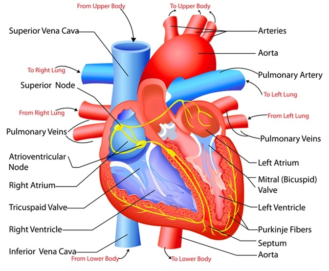

```{r setup, include=FALSE}
knitr::opts_chunk$set(echo = TRUE)
knitr::opts_chunk$set(cache = TRUE)

require(tidyverse)
require(magrittr)
require(R2jags)
require(bayesplot)
require(TeachingDemos)
require(factoextra)
require(highcharter)
require(dplyr)

load_cat <- function(frame) {
    
  sorted_df <- frame %>%
              drop_na() %>%
              dplyr::summarise(Count = n()) %>%
              dplyr::arrange(desc(Count)) %>%
              dplyr::mutate(percentage = paste0(round(Count / sum(Count) * 100, 1), "%"))
    
    return(sorted_df)
}

hist.and.summary <- function(variable, main.title){
  print(summary(dat[[variable]])) 
  hchart(dat[[variable]], type = "column", name = variable, color = randomcoloR::randomColor()) %>%
    hc_title(text = main.title) %>%
    hc_xAxis(title = variable) %>%
    hc_chart(options3d=list(enabled=TRUE, alpha=2, beta=-10, 
                              depth=100, viewDistance=25)) %>% 
    hc_plotOptions(column=list(depth= 100))
}

dense.chart <- function(name, title){ # Showing the density considering the two cases of having an heart attack or not
  
  frame <- dat[ , (names(dat) %in% c(name, 'output'))] # select the interested rows

  # sub select the two categories
  normal <- frame %>% filter(output == 0)
  heart_attack <- frame %>% filter(output == 1)

  hchart( density(unlist(normal[, name])), type = "area", color = randomcoloR::randomColor(), name = "Normal") %>%
      hc_add_series( density(unlist(heart_attack[, name])), type = "area", color = randomcoloR::randomColor(), name = "Heart Attack") %>%
        hc_title(text= title) %>%
          hc_xAxis(title = name)
}
```

$$~$$

<center></center>

$$~$$

# Introduction

$$~$$

Nowadays, with the improvement of the technologies there are an amount of data that allows us to understand if there is any problem or not in the healthy of a person.

Here in this project we explain and we try to predict whether a patient should be diagnosed with Heart Disease or not.

$$~$$

## The Dataset

$$~$$

<center>{width=40%}</center>

$$~$$

Kaggle, is the main platform where I found this interesting dataset where applying our main bayesian inference as the main scope of this project.

This dataset is composed by these features:

```{r echo=FALSE, warning=FALSE}
dat <- read_csv("heart.csv")
dat <- unique(dat) # remove any duplicate presents
head(dat)
```

$$~$$

Analyzing these features, I recognized that the:

<style>
ol ul {
    margin-bottom: 10px;
}
</style>

1. ***Age*** -> it refers to the age of the patient
2. ***sex*** -> it refers if the patient is:
    + male (1)
    + female (0)
3. ***cp*** -> it refers to the chest pain type that could be of four types:
    + 0 is the typical angina
    + 1 is the atypical angina
    + 2 is the non-anginal pain
    + 3 is the asymptomatic type
4. ***trestbps*** -> it refers to the resting blood pressure
5. ***chol*** -> it refers to the serum cholesterol in mg/dl
6. ***fbs*** -> it refers to the fasting blood sugar that if it is larger than 120 mg/dl is represented with:
    + 1 (true)
    + 0 (false)
7. ***restecg*** -> it refers to the resting electrocardiographic results: 
    + 0 as Normal
    + 1 having ST-T wave abnormality (T wave inversions and/or ST elevation or depression of > 0.05 mV)
    + 2) showing probable or definite left ventricular hypertrophy by Estes' criteria
8. ***thalachh*** -> it refers to the maximum heart rate achieved
9. ***exng*** -> it refers to the exercise induced angina that could be:
    + 1 (yes)
    + 0 (no)
10. ***oldpeak*** -> it refers to the Previous peak
11. ***slp*** -> it refers to the peak exercise ST segment: 
    + 0 as up sloping
    + 1 as flat
    + 2 as down sloping
12. ***caa*** -> it refers to the number of major vessels that goes from 0 to 3
13. ***thall*** -> it refers to the maximum heart rate achieved: 
    + 0 as no-data 
    + 1 as normal
    + 2 as fixed defect
    + 3 as reversible defect
14. ***output*** -> it refers to the fact to have the heart attack or not

$$~$$

The main features detected are: 

$$~$$

```{r echo=FALSE}
summary(dat)
```

$$~$$

## The Data Visualization

$$~$$

In this subsection we want to describe graphically the dataset that we are analyzing to have a first taste of what is the better model to use in this case, we want to show below some interesting plots

$$~$$

### The visualization using PCA

$$~$$

PCA is a particular tool that allows us to show the behaviour of the patients (treated as points in this space) of our data. We see in this way which are the patients more similar to each other

$$~$$

```{r echo=FALSE, fig.align="center"}
# for visualization
res.pca <- prcomp(dat, scale = TRUE, center = TRUE) # compute PCA

# patients  with a similar profile are grouped together
fviz_pca_ind(res.pca,
             col.ind = "cos2", # Color by the quality of representation
             gradient.cols = c("#00AFBB", "#E7B800", "#FC4E07"),
             repel =FALSE,     # Avoid text overlapping
             label=FALSE
)

fviz_eig(res.pca) # Show the percentage of variances explained by each principal component
```

$$~$$

Its normal to denote that there could be some losses on this representation due to the amount of features that we want to consider, but here we actually capture 34.9% of variance in the entire dataset using two principal components. 

$$~$$

## The Categorical Data

$$~$$

Here, we want to analyze the percentages of each categorical data:

$$~$$

```{r echo=FALSE}
get_cp_str <- function(bool_var){
  char_list <- c(1, length(bool_var))
  for (i in 1:length(bool_var)) {
    var <- bool_var[i]
    new_char <- 'unknown'  
    
    if(var == 0){
        new_char <- 'typical angina'
    }
      
    if(var == 1){
        new_char <- 'atypical angina'
    }
      
    if(var == 2){
        new_char <- 'non-anginal pain'
    }
      
    if(var == 3){
        new_char <- 'asymptomatic'
    }
      
     char_list[i] <-  new_char
   }
    
    return(char_list)
 }

cp_dat <- dat %>% 
    dplyr::select(cp) %>%
    dplyr::group_by(cp) %>%
    dplyr::summarise(Count = n()) %>%
    dplyr::arrange(desc(Count)) %>%
    dplyr::mutate(
        cp_str = get_cp_str(cp),
        percentage = paste0(round(Count / sum(Count) * 100, 1), "%")
    )

cp_dat %>%
  hchart(type = "pie", hcaes(x = paste(cp_str, ' \t(', percentage, ')' ), y = Count)) %>%
    hc_xAxis(title = 'Chest Pain', categories = paste(cp_dat$cp_str, ' (', cp_dat$percentage, ')' )) %>%
    hc_title(text = 'Chest Pain') %>%
    hc_add_theme(hc_theme_google()) %>%
    hc_chart(options3d=list(enabled=TRUE, alpha=45, beta=0)) %>% 
    hc_plotOptions(pie=list(innerSize= 100, 
                            depth= 45))
```

The most relevant is the ***typical angina (47.4%)*** that is defined as substernal chest pain precipitated by physical exertion or emotional stress and relieved with rest or nitroglycerin (represents inadequate flow of blood and oxygen to the heart). Women and elderly patients are usually have atypical symptoms both at rest and during stress, often in the setting of nonobstructive coronary artery disease (CAD).

$$~$$
 
```{r echo=FALSE}
get_string <- function(bool_var){
  char_list <- c(1, length(bool_var))
  for (i in 1:length(bool_var)) {
    var <- bool_var[i]
    new_char <- 'unknown'  
    
    if(var == 1){
        new_char <- 'prediabetes (fbs > 120 mg/d)'
    }
    else{
        new_char <- 'normal'
     }
      
     char_list[i] <-  new_char
   }
    
    return(char_list)
 }

fbs_dat <- dat %>% 
    dplyr::select(fbs) %>%
    dplyr::group_by(fbs) %>%
    dplyr::summarise(Count = n()) %>%
    dplyr::arrange(desc(Count)) %>%
    dplyr::mutate(
        fbs_str = get_string(fbs),
        percentage = paste0(round(Count / sum(Count) * 100, 1), "%")
    )

fbs_dat %>%
  hchart(type = "pie", hcaes(x = paste(fbs_str, ' \t(', percentage, ')' ), y = Count)) %>%
    hc_xAxis(title = 'fasting blood sugar', categories = paste(get_string(fbs_dat$fbs_str), ' (', fbs_dat$percentage, ')' )) %>%
    hc_title(text = 'Fasting Blood Sugar') %>%
    hc_add_theme(hc_theme_google()) %>%
    hc_chart(options3d=list(enabled=TRUE, alpha=45)) %>% 
    hc_plotOptions(pie=list(innerSize= 100, 
                            depth= 45))
```

```{r echo=FALSE}
get_restecg_str <- function(bool_var){
  char_list <- c(1, length(bool_var))
  for (i in 1:length(bool_var)) {
    var <- bool_var[i]
    new_char <- 'unknown'  
    
    if(var == 0){
        new_char <- 'Normal'
    }
    if(var == 1){
        new_char <- 'lvl 1, having ST-T wave abnormality (T wave inversions and/or ST elevation or depression of > 0.05 mV)'
    }
    if(var == 2){
        new_char <- "lvl 2, showing probable or definite left ventricular hypertrophy by Estes' criteria"
     }
      
     char_list[i] <-  new_char
   }
    
    return(char_list)
 }

restecg_dat <- dat %>% 
    dplyr::select(restecg) %>%
    dplyr::group_by(restecg) %>%
    dplyr::summarise(Count = n()) %>%
    dplyr::arrange(desc(Count)) %>%
    dplyr::mutate(
        restecg_str = get_restecg_str(restecg),
        percentage = paste0(round(Count / sum(Count) * 100, 1), "%")
    )

restecg_dat %>%
  hchart(type = "pie", hcaes(x = paste(restecg_str, ' \t(', percentage, ')' ), y = Count)) %>%
    hc_xAxis(title = 'restecg', categories = paste(restecg_dat$restecg_str, ' (', restecg_dat$percentage, ')' )) %>%
    hc_title(text = 'Resting Electrocardiographic Results') %>%
    hc_add_theme(hc_theme_google()) %>%
    hc_chart(options3d=list(enabled=TRUE, alpha=45)) %>% 
    hc_plotOptions(pie=list(innerSize= 100, 
                            depth= 45))
```

```{r echo=FALSE}
slp_dat <- load_cat(
              dat %>%
               dplyr::select(slp) %>%
               dplyr::group_by(slp)
             )

slp_dat %>%
  hchart(type = "pie", hcaes(x = paste(slp, ' \t(', percentage, ')' ), y = Count)) %>%
    hc_xAxis(title = 'Slope', categories = paste(slp_dat$slp, ' (', slp_dat$percentage, ')' )) %>%
    hc_title(text = 'Slope') %>%
    hc_add_theme(hc_theme_google()) %>%
    hc_chart(options3d=list(enabled=TRUE, alpha=45)) %>% 
    hc_plotOptions(pie=list(innerSize= 100, 
                            depth= 45))
    
```

the ST/heart rate slope (ST/HR slope), has been proposed as a more accurate ECG criterion for diagnosing significant coronary artery disease (CAD). The most relevant rate slope is approximately between the first and second type (as flat and as down sloping). 

$$~$$

```{r echo=FALSE}
caa_dat <- load_cat(
              dat %>%
               dplyr::select(caa) %>%
               dplyr::group_by(caa)
             )

caa_dat %>%
  hchart(type = "pie", hcaes(x = paste(caa, ' \t(', percentage, ')' ), y = Count)) %>%
    hc_xAxis(title = 'caa', categories = paste(caa_dat$caa, ' (', caa_dat$percentage, ')' )) %>%
    hc_title(text = 'Number of Major Vessels (0-4)') %>%
    hc_add_theme(hc_theme_google()) %>%
    hc_chart(options3d=list(enabled=TRUE, alpha=45)) %>% 
    hc_plotOptions(pie=list(innerSize= 100, 
                            depth= 45))

```

The most case is about 0 major vessels that aren't affect of any damaged, but in other little case we see that there are a bunch of major vessels that have a problem, within the heart.

$$~$$

```{r echo=FALSE}

thall_dat <- load_cat(
              dat %>%
               dplyr::select(thall) %>%
               dplyr::group_by(thall)
             )

thall_dat %>%
  hchart(type = "pie", hcaes(x = paste(thall, ' \t(', percentage, ')' ), y = Count)) %>%
    hc_xAxis(title = 'Thall', categories = paste(thall_dat$thall, ' (', thall_dat$percentage, ')' )) %>%
    hc_title(text = 'Thall') %>%
    hc_add_theme(hc_theme_google()) %>%
    hc_chart(options3d=list(enabled=TRUE, alpha=45)) %>% 
    hc_plotOptions(pie=list(innerSize= 100, 
                            depth= 45))

```

the maximum rate achieved is about a fixed defect.

$$~$$

```{r echo=FALSE}
make_string <- function(bool_var){
  char_list <- c(1, length(bool_var))
  for (i in 1:length(bool_var)) {
    var <- bool_var[i]
    new_char <- 'unknown'  
    
    if(var == 1){
        new_char <- 'Yes'
    }
    else{
        new_char <- 'No'
     }
      
     char_list[i] <-  new_char
   }
    
    return(char_list)
 }

exng_dat <- dat %>% 
    dplyr::select(exng) %>%
    dplyr::group_by(exng) %>%
    dplyr::summarise(Count = n()) %>%
    dplyr::arrange(desc(Count)) %>%
    dplyr::mutate(
        exng_txt = make_string(exng),
        percentage = paste0(round(Count / sum(Count) * 100, 1), "%")
    )
exng_dat %>%
  hchart(type = "pie", hcaes(x = paste(exng_txt, ' \t(', percentage, ')' ), y = Count)) %>%
    hc_xAxis(title = 'Exercise Induced Angina', categories = paste(exng_dat$exng_txt, ' (', exng_dat$percentage, ')' )) %>%
    hc_title(text = 'Exercise Induced Angina (1 = yes; 0 = no)') %>%
    hc_add_theme(hc_theme_google()) %>%
    hc_chart(options3d=list(enabled=TRUE, alpha=45)) %>% 
    hc_plotOptions(pie=list(innerSize= 100, 
                            depth= 45))

```

Angina may feel like pressure in the chest, jaw or arm. It frequently may occur with exercise or stress. Some people with angina also report feeling lightheaded, overly tired, short of breath or nauseated. As the heart pumps harder to keep up with what you are doing, it needs more oxygen-rich blood. This reflects to the fact that we have no exercise induced by angina.

$$~$$

```{r echo=FALSE}

make_string = function(bool_var){
  char_list = c(1, length(bool_var))
  for (i in 1:length(bool_var)) {
    var = bool_var[i]
    new_char = 'unknown'  
    
    if(var == 1){
        new_char = 'Male'
    }
    else{
        new_char = 'Female'
     }
      
     char_list[i] =  new_char
   }
    
    return(char_list)
 }

gender_dat <- dat %>% 
    dplyr::select(sex) %>%
    dplyr::group_by(sex) %>%
    dplyr::summarise(Count = n()) %>%
    dplyr::arrange(desc(Count)) %>%
    dplyr::mutate(
        gender = make_string(sex),
        percentage = paste0(round(Count / sum(Count) * 100, 1), "%")
    )


gender_dat %>%
  hchart(type = "pie", hcaes(x = paste(gender, ' \t(', percentage, ')' ), y = Count)) %>%
    hc_xAxis(categories = paste(gender_dat$gender, ' (', gender_dat$percentage, ')' )) %>%
    hc_title(text = "Person's Gender") %>%
    hc_add_theme(hc_theme_google()) %>%
    hc_chart(options3d=list(enabled=TRUE, alpha=45)) %>% 
    hc_plotOptions(pie=list(innerSize= 100, 
                            depth= 45))
              
``` 

```{r echo=FALSE}
make_string_heart <- function(bool_var){
  char_list <- c(1, length(bool_var))
  for (i in 1:length(bool_var)) {
    var <- bool_var[i]
    new_char <- 'unknown'  

    if(var == 0){
        new_char <- '0 - Normal'
     }
      
    if(var == 1){
        new_char <- '1 - Heart Attack'
    }
      
     char_list[i] <-  new_char
   }
    
    return(char_list)
 }

output_dat <- dat %>% 
    dplyr::select(output) %>%
    dplyr::group_by(output) %>%
    dplyr::summarise(Count = n()) %>%
    dplyr::arrange(desc(Count)) %>%
    dplyr::mutate(
        heart_attack = make_string_heart(output),
        percentage = paste0(round(Count / sum(Count) * 100, 1), "%")
    )


output_dat %>%
  hchart(type = "pie", hcaes(x = paste(heart_attack, ' \t(', percentage, ')' ), y = Count)) %>%
    hc_xAxis(categories = paste(output_dat$heart_attack, ' (', gender_dat$percentage, ')' )) %>%
    hc_title(text = 'Heart Attack') %>%
    hc_add_theme(hc_theme_google())  %>%
    hc_chart(options3d=list(enabled=TRUE, alpha=45)) %>% 
    hc_plotOptions(pie=list(innerSize= 100, 
                            depth= 45))         

```

$$~$$

## The Quantitative Data

$$~$$

Here, we illustrate the main features of the quantitative data, after have seen the categorical data in the previous section:

$$~$$

```{r, fig.width = 8, fig.height = 6}
hist.and.summary('age', 'Persons Age')
hist.and.summary('chol', 'Cholestoral')
hist.and.summary('thalachh', 'Maximum Heart Rate Achieved')
hist.and.summary('trtbps', 'Resting Blood Pressure')
hist.and.summary('oldpeak', 'Previous Peak')
```

$$~$$

After this, we consider also the densities considering the case of having the heart attack and not:

$$~$$

```{r}
dense.chart('age', 'Persons Age')
dense.chart('chol', 'Cholestoral')
dense.chart('thalachh', 'Maximum Heart Rate Achieved')
dense.chart('trtbps', 'Resting Blood Pressure')
dense.chart('oldpeak', 'Previous Peak')
```


## The Correlations

$$~$$

Here, we want to highlight the correlations between the features treated in qualitative, quantitative and without any distinction.

$$~$$

```{r echo=FALSE}
hchart(cor(dat[, c("sex", "cp", "fbs", "restecg", "exng", "slp", "caa", "thall")]), color = randomcoloR::randomColor()) %>%
  hc_title(text = "Correlations between qualitative variables") # considering only the qualitative data

hchart(cor(dat[, c("age", "chol", "thalachh", "trtbps", "oldpeak")]), color = randomcoloR::randomColor()) %>%
  hc_title(text = "Correlations between quantitative variables") # considering only the quantitative data

hchart(cor(dat[, c(1:13)]), color = randomcoloR::randomColor()) %>%
  hc_title(text = "Correlations between all independent variables") # considering only the whole data
```

# The Goal

$$~$$

The main goal is to leverage the main fully Bayesian analysis, based on understanding if a person has a heart attack or not. 

So, the response variable $Y_i$ (that is the "output" feature in our dataset) is the heart attack $\in \{0,1\}$ and the predictor variables ($x_i \in \mathbb{R}^{+}$) have been chosen using the glm() function (we are cheating, but in this way we can sure that we are catching the right variables), used to fit generalized linear models, as we can see below:

$$~$$

```{r echo=FALSE}
# Preparing data for JAGS
N <- nrow(dat) # number of obs

# Dependent Variable
y <- as.vector(dat$output) # Target variable, risks heart attack?

# Independent Variables
x1 <- as.vector(dat$age) # Age
x2 <- as.vector(dat$sex) # Sex
x3 <- as.vector(dat$cp) # Chest Pain Type: 1) Typical Angina 2) Atypical Angina 3) Non-Anginal Pain 4) Asymptomatic
x4 <- as.vector(dat$trtbps) # resting blood pressure (in mm Hg)
x5 <- as.vector(dat$chol) # cholestoral in mg/dl fetched via BMI sensor
x6 <- as.vector(dat$fbs) # (fasting blood sugar > 120 mg/dl) (1 = true; 0 = false)
x7 <- as.vector(dat$restecg) # resting electrocardiographic results 0) Normal 1) having ST-T wave abnormality (T wave inversions and/or ST elevation or depression of > 0.05 mV) 2) showing probable or definite left ventricular hypertrophy by Estes' criteria 
x8 <- as.vector(dat$thalachh) # maximum heart rate achieved
x9 <- as.vector(dat$exng) # exercise induced angina (1 = yes; 0 = no)
x10 <- as.vector(dat$oldpeak) # Previous peak
x11 <- as.vector(dat$slp) # Slope
x12 <- as.vector(dat$caa) # number of major vessels (0-3)
x13 <- as.vector(dat$thall) # Thal rate

summary(glm(y ~ x1+x2+x3+x4+x5+x6+x7+x8+x9+x10+x11+x12+x13, family = binomial(),data=dat))
```

$$~$$

As we can see above, the glm rejects the hypothesis to consider the variables:

- ***Age ~ $x_1$***
- ***Cholestoral ~ $x_5$***
- ***fasting blood sugar ~ $x_6$***
- ***resting electrocardiographic results ~ $x_7$***

... and also the ***intercept*** isn't a good choice to admit it in our model.

then, in summary we have N = 302 observations. Then we decided to consider two models and see the difference on which model at the end is the best model of our analysis.

$$~$$

# Preliminary brief definitions

$$~$$

- ***Likelihood $\pi(y_{obs}|\theta)$:*** measures the goodness of fit of a statistical model to ***a sample of data for given values of the unknown parameters***. It is formed from the joint probability distribution of the sample, but viewed and used as a function of the parameters only, thus treating the random variables as fixed at the observed values.

- ***Logistic regression model:*** Logistic regression is the appropriate regression analysis to conduct when the dependent variable is dichotomous (binary). Logistic regression is used to describe data and to explain the relationship between one dependent binary variable and one or more nominal, ordinal, interval or ratio-level independent variables.

- ***logit link function:*** it uses the Cumulative Distribution Function (CDF) of the logistic distribution. A benefit to using Logit is that the coefficients can be interpreted in the terms of odds ratios.

- ***cloglog function:*** Is unlike Logit and Probit asymmetric. It is best used when the probability of an event is very small or very large.  The complementary log-log approaches 0 infinitely slower than any other link function. Cloglog model is closely related to continuous-time models for the occurrence of events, so it has an important application in the area of survival analysis and hazard modeling.

- ***Prior $\pi(\theta)$:*** is the probability distribution that would ***express one's beliefs*** about this quantity ***before some evidence is taken into account***.

- ***the deviance:*** is a goodness-of-fit statistic for a statistical model; it is often used for statistical hypothesis testing. It is a generalization of the idea of using the sum of squares of residuals (RSS) in ordinary least squares to cases where model-fitting is achieved by maximum likelihood.


$$~$$

# The First Model (link function with logit)

$$~$$

In the first model, we decide to consider the following logistic regression model with the logit link function: 

$$
Y_i \sim Bern(logit(p_i)) \\
logit(p_i) = \beta_{2} \cdot x_{2_i} + \beta_{3} \cdot x_{3_i} + \beta_{4} \cdot x_{4_i} +\beta_{8} \cdot x_{8_i} + \beta_{9} \cdot x_{9_i} + \beta_{10} \cdot x_{10_i} + \beta_{11} \cdot x_{11_i} + \beta_{12} \cdot x_{12_i} + \beta_{13} \cdot x_{13_i}
$$
The prior beta parameters are chosen approximatly considering the estimated averages saw in the previous subsection regarding the outcomes of glm(). So, the beta prior parameters are distributed following a normal distribution as follows:

$$
\beta_2 \sim N(\mu_2 = -1, \tau^{2} = 1.0 \cdot 10^{-6}) \\
\beta_3 \sim N(\mu_3 = 0.5, \tau^{2} = 1.0 \cdot 10^{-6}) \\
\beta_4 \sim N(\mu_4 = 0, \tau^{2} = 1.0 \cdot 10^{-6}) \\
\beta_8 \sim N(\mu_8 = 0, \tau^{2} = 1.0 \cdot 10^{-6}) \\
\beta_9 \sim N(\mu_9 = -0.5, \tau^{2} = 1.0 \cdot 10^{-6}) \\
\beta_{10} \sim N(\mu_{10} = 0.5, \tau^{2} = 1.0 \cdot 10^{-6}) \\
\beta_{11} \sim N(\mu_{11} = 0.5, \tau^{2} = 1.0 \cdot 10^{-6}) \\
\beta_{12} \sim N(\mu_{12} = -0.5, \tau^{2} = 1.0 \cdot 10^{-6}) \\
\beta_{13} \sim N(\mu_{13} = -0.5, \tau^{2} = 1.0 \cdot 10^{-6}) \\
$$

The main reason is that we prefer chosing the binary classification as in this case the logistic regression to model our outcomes based only on 0 or 1.

$$~$$

### Implementing RJags

$$~$$

As we can see, we implemented the model using RJags:

$$~$$

- The model is defined as follows:

$$~$$

```{r}
model <- function(){
  # Likelihood
  for (i in 1:N){
    y[i] ~ dbern(p[i])
    logit(p[i]) <-  beta2*x2[i] + beta3*x3[i] + beta4*x4[i] + beta8*x8[i] + beta9*x9[i] + beta10*x10[i] + beta11*x11[i] + beta12*x12[i] + beta13*x13[i] # omit intercept and not useful variables
  }
  
  # Defining the prior beta parameters
  beta2 ~ dnorm(-1, 1.0E-6)
  beta3 ~ dnorm(0.5, 1.0E-6)
  beta4 ~ dnorm(0, 1.0E-6)
  beta8 ~ dnorm(0, 1.0E-6)
  beta9 ~ dnorm(-0.5, 1.0E-6)
  beta10 ~ dnorm(0.5, 1.0E-6)
  beta11 ~ dnorm(0.5, 1.0E-6)
  beta12 ~ dnorm(-0.5, 1.0E-6)
  beta13 ~ dnorm(-0.5, 1.0E-6)
}
```

***remark:*** that the standard deviation in RJags is considered as the precision, so the $\tau^2 = \frac{1}{\sigma^{2}}$

$$~$$

- Data structuring as requested with highlight which parameters to consider:

```{r}
# Passing the data for RJags
data.jags <- list("y" = y, "N" = N,
                  "x2" = x2, "x3" = x3, "x4" = x4, "x8" = x8, "x9" = x9, "x10" = x10, "x11" = x11, "x12" = x12, "x13" = x13)

# Defining parameters of interest to show after running RJags
mod.params <- c("beta2", "beta3", "beta4", "beta8", "beta9", "beta10", "beta11", "beta12", "beta13")
```

$$~$$

- Running the model with the following results:

```{r}
# Run JAGS
set.seed(123)
n.chains <- 3
mod.fit <- jags(data = data.jags,                                                 # DATA
                model.file = model,                                               # MODEL
                parameters.to.save = mod.params,                                  # TRACKING
                n.chains = n.chains, n.iter = 10000, n.burnin = 1000, n.thin=10)  # MCMC

mod.fit
```

$$~$$

In this last running of the MCMC we have interesting results:

- ***mu.vect*** and ***sd.vect:*** these values representing the estimated values after simulating the MCMC.

- ***the percentages (quantiles):*** represents the quantiles of the interval where the parameter is likely in

- ***RHat:*** The values near 1 suggest convergence

- ***n.eff:*** is the effective number of samples to achieve the convergence, the stationary region.

just to have a look, let’s check how the fitting curve look like if we use the obtained estimates:

```{r echo=FALSE}


```

$$~$$

### The stationary regions

$$~$$

Here, we show the univariate trace-plots of the simulations of each parameter:

```{r echo=FALSE, fig.align="center"}
traceplot(mod.fit)
```


$$~$$

### The Cumulative Means

$$~$$
In this section we want to see the empirical average of $\mathbf{\hat{I}}_{t}$ increasing the value of $t \, = \, 1,...,T$. Before starting, we want to write the formula of $\mathbf{\hat{I}}_{t}$ that is:

$$~$$

$$
\mathbf{I} \approx \mathbf{\hat{I}}_{t} = \frac{1}{T} \sum_{i=1}^{T} h(\theta^{(i)})
$$

$$~$$

is important to write $\approx$ because this leverages the SLLN theorem and we want also to confirm this assumption! So, let's see the results:

$$~$$

```{r echo=FALSE}
df <- as.data.frame(mod.fit$BUGSoutput$sims.array)
  
df %>%
  hchart('line', hcaes(x = 1:nrow(df), y = cummean(df[, 1])), color = "red", name = "First Chain") %>%
    hc_add_series( cummean(df[, 2]), type = "line", color = "blue", name = "Second Chain") %>%
      hc_add_series( cummean(df[, 3]), type = "line", color = "green", name = "Thrid Chain") %>%
        hc_title(text = "The Empirical Mean of beta10") %>%
          hc_xAxis(title = list(text = "Iteration")) %>%
            hc_yAxis(title = list(text = 'Cumulative Mean'))

df %>%
  hchart('line', hcaes(x = 1:nrow(df), y = cummean(df[, 4])), color = "red", name = "First Chain") %>%
    hc_add_series( cummean(df[, 5]), type = "line", color = "blue", name = "Second Chain") %>%
      hc_add_series( cummean(df[, 6]), type = "line", color = "green", name = "Thrid Chain") %>%
        hc_title(text = "The Empirical Mean of beta11") %>%
          hc_xAxis(title = list(text = "Iteration")) %>%
            hc_yAxis(title = list(text = 'Cumulative Mean'))

df %>%
  hchart('line', hcaes(x = 1:nrow(df), y = cummean(df[, 7])), color = "red", name = "First Chain") %>%
    hc_add_series( cummean(df[, 8]), type = "line", color = "blue", name = "Second Chain") %>%
      hc_add_series( cummean(df[, 9]), type = "line", color = "green", name = "Thrid Chain") %>%
        hc_title(text = "The Empirical Mean of beta12") %>%
          hc_xAxis(title = list(text = "Iteration")) %>%
            hc_yAxis(title = list(text = 'Cumulative Mean'))

df %>%
  hchart('line', hcaes(x = 1:nrow(df), y = cummean(df[, 10])), color = "red", name = "First Chain") %>%
    hc_add_series( cummean(df[, 11]), type = "line", color = "blue", name = "Second Chain") %>%
      hc_add_series( cummean(df[, 12]), type = "line", color = "green", name = "Thrid Chain") %>%
        hc_title(text = "The Empirical Mean of beta13") %>%
          hc_xAxis(title = list(text = "Iteration")) %>%
            hc_yAxis(title = list(text = 'Cumulative Mean'))

df %>%
  hchart('line', hcaes(x = 1:nrow(df), y = cummean(df[, 10])), color = "red", name = "First Chain") %>%
    hc_add_series( cummean(df[, 11]), type = "line", color = "blue", name = "Second Chain") %>%
      hc_add_series( cummean(df[, 12]), type = "line", color = "green", name = "Thrid Chain") %>%
        hc_title(text = "The Empirical Mean of beta2") %>%
          hc_xAxis(title = list(text = "Iteration")) %>%
            hc_yAxis(title = list(text = 'Cumulative Mean'))

df %>%
  hchart('line', hcaes(x = 1:nrow(df), y = cummean(df[, 13])), color = "red", name = "First Chain") %>%
    hc_add_series( cummean(df[, 14]), type = "line", color = "blue", name = "Second Chain") %>%
      hc_add_series( cummean(df[, 15]), type = "line", color = "green", name = "Thrid Chain") %>%
        hc_title(text = "The Empirical Mean of beta3") %>%
          hc_xAxis(title = list(text = "Iteration")) %>%
            hc_yAxis(title = list(text = 'Cumulative Mean'))

df %>%
  hchart('line', hcaes(x = 1:nrow(df), y = cummean(df[, 16])), color = "red", name = "First Chain") %>%
    hc_add_series( cummean(df[, 17]), type = "line", color = "blue", name = "Second Chain") %>%
      hc_add_series( cummean(df[, 18]), type = "line", color = "green", name = "Thrid Chain") %>%
        hc_title(text = "The Empirical Mean of beta4") %>%
          hc_xAxis(title = list(text = "Iteration")) %>%
            hc_yAxis(title = list(text = 'Cumulative Mean'))

df %>%
  hchart('line', hcaes(x = 1:nrow(df), y = cummean(df[, 19])), color = "red", name = "First Chain") %>%
    hc_add_series( cummean(df[, 20]), type = "line", color = "blue", name = "Second Chain") %>%
      hc_add_series( cummean(df[, 21]), type = "line", color = "green", name = "Thrid Chain") %>%
        hc_title(text = "The Empirical Mean of beta8") %>%
          hc_xAxis(title = list(text = "Iteration")) %>%
            hc_yAxis(title = list(text = 'Cumulative Mean'))

df %>%
  hchart('line', hcaes(x = 1:nrow(df), y = cummean(df[, 22])), color = "red", name = "First Chain") %>%
    hc_add_series( cummean(df[, 23]), type = "line", color = "blue", name = "Second Chain") %>%
      hc_add_series( cummean(df[, 24]), type = "line", color = "green", name = "Thrid Chain") %>%
        hc_title(text = "The Empirical Mean of beta9") %>%
          hc_xAxis(title = list(text = "Iteration")) %>%
            hc_yAxis(title = list(text = 'Cumulative Mean'))

df %>%
  hchart('line', hcaes(x = 1:nrow(df), y = cummean(df[, 25])), color = "red", name = "First Chain") %>%
    hc_add_series( cummean(df[, 26]), type = "line", color = "blue", name = "Second Chain") %>%
      hc_add_series( cummean(df[, 27]), type = "line", color = "green", name = "Thrid Chain") %>%
        hc_title(text = "The Empirical Mean of deviance") %>%
          hc_xAxis(title = list(text = "Iteration")) %>%
            hc_yAxis(title = list(text = 'Cumulative Mean'))
```

$$~$$

### Some other interesting plots

$$~$$

We are considering other interesting plots, underlining also each chain alone:

```{r echo=FALSE, fig.align="center"}
# Plots with BayesPlot
chainArray <- mod.fit$BUGSoutput$sims.array

# considering to split each couples of parameters
bayesplot::mcmc_combo(chainArray, pars = c("deviance", "beta2", "beta3"))
bayesplot::mcmc_combo(chainArray, pars = c("beta4", "beta8", "beta9", "beta10"))
bayesplot::mcmc_combo(chainArray, pars = c("beta11", "beta12", "beta13"))
```

$$~$$
Now, we want to see the autocorrelations of each parameter:

```{r echo=FALSE, fig.align="center", fig.width=10, fig.height=10}
coda.fit <- coda::as.mcmc(mod.fit)
coda::acfplot(coda.fit)

autocorr.diag(as.mcmc(mod.fit))
```

$$~$$
The ACFs follow good behaviours, because we need to have samples independent each other during new iterations. Here, we see that the correlations are going further from the first lag, this is strictly decreasing. So, this is a good point!

We can conferm our intuition also with the values returned by autocorr.diag() that it returned the vector of the average autocorrelations across all chains.

$$~$$

### The Approximation Error

$$~$$
Here, we want to analyze the best approximation error for the MCMC sampling. We consider, essentially the square root of the MCSE.

The variance formula in the MCMC samplig is:

$$
\mathbf{V}[\hat{I}_{t}] = \frac{Var_{\pi}[h(X_{1})]}{t_{eff}} = \Big( 1 + 2 \sum_{k=1}^{\infty} \rho_{k}\Big)\frac{\sigma^{2}}{T}
$$
where $t_{eff}$ is the effective sample size (ESS). The idea is to have a sort of “exchange rate” between dependent and independent samples. 

We can say, if we have 1,000 samples from a certain Markov chain are worth about as much as 70 independent samples because the MCMC samples are highly correlated. 

Or if you have 1,000 samples from a different Markov chain are worth about as much as 400 independent samples because although the MCMC samples are dependent, they’re weakly correlated. 

...More formal details on the slides.

As we can see the model 1 has these effective samples size for each parameters involved in this analysis:

```{r echo=FALSE}
mod.fit$BUGSoutput$summary[,"n.eff"]
```

means that our samples, respect 10000 iterations, are weakly correlated.

...now let's move on to calculate the MCSE

in this case we want to consider the MCSE that is the square root of the formula written above, So the results are (for each chain):

```{r}
n <- length(colnames(mod.fit$BUGSoutput$sims.matrix))

mcse_dataframe <- data.frame(MCSE_jointly = rep(NA, n))

rownames(mcse_dataframe) <- colnames(mod.fit$BUGSoutput$sims.matrix)[1:n] 

for(colname in colnames(mod.fit$BUGSoutput$sims.matrix)[1:n]){
  mcse_dataframe[colname, "MCSE_jointly"] <- LaplacesDemon::MCSE(mod.fit$BUGSoutput$sims.matrix[ , colname])
}

mcse_dataframe
```

$$~$$
As we can see the $\beta_2$ has the highest uncertainty considering the jointly chains.

$$~$$

### Posterior uncertainty

$$~$$
The uncertainty is measured by using the variability of the parameter w.r.t. its absolute expectation:

```{r echo=FALSE}
variab <- as.data.frame(mod.fit$BUGSoutput$summary[, c("mean","sd")])
variab$variability <- apply(variab, 1, function(x){
  return(x["sd"]/abs(x["mean"]))
})
variab
```

The highest posterior uncertainty is about the $\beta_4$.

$$~$$

## Hypotheses and Testing of the convergences of these multiple Markov chains 

$$~$$
Here, we want to understand if we achieve with these multiple simulations of the markov chains the convergences. We are considering one of the tools saw in the last lectures, to understand if we achieve or not the convergency this is more powerful than the other tools.

$$~$$

## Heidel Test

$$~$$
Implements a convergence diagnostic, and removes up to half the chain in order to ensure that the means are estimated from a chain that has converged.

The ***convergence test*** uses the Cramer-von-Mises statistic to test the null hypothesis that the sampled values come from a stationary distribution. 

The test is successively applied, firstly to the whole chain, then after discarding the first 10%, 20%, … of the chain until either the null hypothesis is accepted, or 50% of the chain has been discarded. 

The latter outcome constitutes `failure' of the stationarity test and indicates that a longer MCMC run is needed. If the stationarity test is passed, the number of iterations to keep and the number to discard are reported.

The ***half-width test*** calculates a 95% confidence interval for the mean, using the portion of the chain which passed the stationarity test. 

Half the width of this interval is compared with the estimate of the mean. If the ratio between the half-width and the mean is lower than eps, the halfwidth test is passed. Otherwise the length of the sample is deemed not long enough to estimate the mean with sufficient accuracy.

$$~$$

```{r echo=FALSE, fig.align="center"}
coda::heidel.diag(coda.fit)
```

$$~$$
We prefer considering the Heidel test because it is a double check of the stationarity and the convergency states. This is sometimes failed, meanwhile the other tools seems to be good, so I prefer considering this test.

Here, we can see all is considered correctly, so our intuitions are correct!

$$~$$

### The Predictions

$$~$$

Here, we want to illustrate how using the markov chain to approximate the posterior predictive distribution of the people that could have the heart attack or not considering the features explained above. So, we want to approximate this area:

$$
m(y_{new}) = \int_{\Theta} f(y_{new}|\theta, Y_{old}, x_2, x_3, x_4, x_8, x_9, x_{10}, x_{11}, x_{12}, x_{13})\pi(\theta)d\theta
$$

where the $\theta$ is equal to the coefficients used and considered before, $\Theta$ is the parameter space and $\pi(\theta)$ is the product of the priors thanks to marginal independence assumption. At the end, we want to smaple from the $\pi(\theta)$ and from $f(y_{new}|\theta, Y_{old}, x_2, x_3, x_4, x_8, x_9, x_{10}, x_{11}, x_{12}, x_{13})$. 

Here, there is a brief practical example:

```{r}
new_record <- list(x2 = sample(x2, 1, replace = T), x3 = sample(x3, 1, replace = T), x4 = sample(x4, 1, replace = T), x8 = sample(x8, 1, replace = T), x9 = sample(x9, 1, replace = T),
                   x10 = sample(x10, 1, replace = T), x11 = sample(x11, 1, replace = T), x12 = sample(x12, 1, replace = T), x13 = sample(x13, 1, replace = T))

x <- mod.fit$BUGSoutput$sims.matrix[,"beta2"]*new_record$x2 + mod.fit$BUGSoutput$sims.matrix[,"beta3"]*new_record$x3 + mod.fit$BUGSoutput$sims.matrix[,"beta4"]*new_record$x4 + mod.fit$BUGSoutput$sims.matrix[,"beta8"]*new_record$x8 + mod.fit$BUGSoutput$sims.matrix[,"beta9"]*new_record$x9 + mod.fit$BUGSoutput$sims.matrix[,"beta10"]*new_record$x10 + mod.fit$BUGSoutput$sims.matrix[,"beta11"]*new_record$x11 + mod.fit$BUGSoutput$sims.matrix[,"beta12"]*new_record$x12 + mod.fit$BUGSoutput$sims.matrix[,"beta13"]*new_record$x13	
x_mu <- 1/(1+exp(-x))

y_pred <- unlist(lapply(x_mu, function(x) rbinom(n = 1, size = 1, prob = x)))
sd(y_pred)
prop.table(table(y_pred))
prop.table(table(y))

summary(y_pred)[4]
hchart(y_pred, type = "column", name = "model1", color = randomcoloR::randomColor()) %>%
  hc_title(text = "Predictions with model 1") %>%
  hc_xAxis(title = "model1") %>%
  hc_chart(options3d=list(enabled=TRUE, alpha=2, beta=-10, 
                          depth=100, viewDistance=25)) %>% 
  hc_plotOptions(column=list(depth= 100))
```

After read, the whole project report we will see which is the best model here in terms of predictions, stay tuned! 

$$~$$

### The Correlations

$$~$$

Here, we bring the correlations between all the values calculated during the MCMC sampling, considering the joining matrix:

```{r echo=FALSE}
hchart(cor(mod.fit$BUGSoutput$sims.matrix)) %>%
  hc_title(text = "Correlations between all the parameters calculated") # considering only the whole data
```

the highest correlation is between $\beta_4 \text{ and } \beta_8$.

$$~$$

# The Second Model

$$~$$
Now, we want to focus to another model always the logistic regression with the whole features and a new link function, the ***cloglog function***.

Why this changment? Because, we want to see which model is better... and how can you see this? I'll tell you where you can easy see this better preference. 

What is the link function? So, the link function transforms the probabilities of the levels of a categorical response variable to a continuous scale that is unbounded. Once the transformation is complete, the relationship between the predictors and the response can be modeled with the logistic regression for example.

As we can see we will reproduce this second model changing the link function to see if it is better or not than the previous model:

$$~$$

```{r echo=FALSE, fig.align="center"}
# Writing model for jags
model2 <- function(){
  # Likelihood
  for (i in 1:N){
    y[i] ~ dbern(p[i])
    cloglog(p[i]) <-  beta1*x1[i] + beta2*x2[i] + beta3*x3[i] + beta4*x4[i] + beta5*x5[i] + beta6*x6[i] + beta7*x7[i] + beta8*x8[i] + beta9*x9[i] + beta10*x10[i] + beta11*x11[i] + beta12*x12[i] + beta13*x13[i] # omit intercept and not useful variables
  }
  
  # Defining the priors
  beta1 ~ dnorm(0, 1.0E-6)
  beta2 ~ dnorm(-1, 1.0E-6)
  beta3 ~ dnorm(0.5, 1.0E-6)
  beta4 ~ dnorm(0, 1.0E-6)
  beta5 ~ dnorm(0, 1.0E-6)
  beta6 ~ dnorm(0, 1.0E-6)
  beta7 ~ dnorm(0.5, 1.0E-6)
  beta8 ~ dnorm(0, 1.0E-6)
  beta9 ~ dnorm(-0.5, 1.0E-6)
  beta10 ~ dnorm(0.5, 1.0E-6)
  beta11 ~ dnorm(0.5, 1.0E-6)
  beta12 ~ dnorm(-0.5, 1.0E-6)
  beta13 ~ dnorm(-0.5, 1.0E-6)
}

# Passing the data for RJags
data.jags2 <- list("y" = y, "N" = N,
                  "x1" = x1, "x2" = x2, "x3" = x3, "x4" = x4, 
                  "x5" = x5, "x6" = x6, "x7" = x7, "x8" = x8, 
                  "x9" = x9, "x10" = x10, "x11" = x11, "x12" = x12, "x13" = x13)

# Defining parameters of interest to show after running RJags
mod.params2 <- c("beta1", "beta2", "beta3", "beta4", "beta5", "beta6", "beta7", "beta8", "beta9", "beta10", "beta11", "beta12", "beta13")

mod.fit2 <- jags(data = data.jags2,                                               # DATA
                model.file = model2,                                             # MODEL
                parameters.to.save = mod.params2,                                # TRACKING
                n.chains = n.chains, n.iter = 10000, n.burnin = 1000, n.thin=10)       # MCMC

mod.fit2
```

$$~$$

Can you see something different? Seems yes.. see the DIC! Is better the previous model (although the difference is too tiny, but the previous model is better).

...mmh, what is the DIC?

$$~$$

# The comparison between these two models

$$~$$
As we can see above, we tried to make a different model only changing the link function to see if it is better to associate with our data, the DIC (Deviance information criterion) is our indicator that says to us which is the better model.

The deviance information criterion (DIC) is a hierarchical modeling generalization of the Akaike information criterion (AIC). It is particularly useful in Bayesian model selection problems where the posterior distributions of the models have been obtained by Markov chain Monte Carlo (MCMC) simulation. DIC is an asymptotic approximation as the sample size becomes large, like AIC.

the DIC is calculated as:

$$
DIC = p_D + \overline{D(\theta)}
$$
where: 

- there are two calculations in common usage for the effective number of parameters of the model. 
    + the first, as described in Spiegalhalter et al. (2002, p.587) is p_D = $\overline{D(\theta)} - D(\overline{\theta})$, where $\overline{\theta}$ is the expectation of $\theta$ 
    + ...and the second described in Gelman et al. (2004, p.587) is $p_D = \frac{1}{2}\mathbb{V}(D(\theta))$. 
    
The larger the effective number of parameters is, the easier it is for the model to fit the data, and so the deviance needs to be penalized.

- the deviance is $D(\theta) = -2log(p(y|\theta)) + C$, where y are the data, $\theta$ are unknown parameters of the model and C is a constant.

Lower is the DIC value better is the accuracy of the model, in this case is better the first model.

$$~$$

# The Conclusions

$$~$$
We try to plot the logistic regression using the parameters obtained in the first model, we compare the line for each parameter-response variable:

```{r echo=FALSE}
x_logits <- mod.fit$BUGSoutput$summary["beta2","mean"]*x2 + mod.fit$BUGSoutput$summary["beta3","mean"]*x3 + mod.fit$BUGSoutput$summary["beta4","mean"]*x4 + mod.fit$BUGSoutput$summary["beta8","mean"]*x8 + mod.fit$BUGSoutput$summary["beta9","mean"]*x9 + mod.fit$BUGSoutput$summary["beta10","mean"]*x10 + mod.fit$BUGSoutput$summary["beta11","mean"]*x11 + mod.fit$BUGSoutput$summary["beta12","mean"]*x12 + mod.fit$BUGSoutput$summary["beta13","mean"]*x13

x_probs <- 1/(1+exp(-x_logits))

x1 <- as.vector(dat$age) # Age
x2 <- as.vector(dat$sex) # Sex
x3 <- as.vector(dat$cp) # Chest Pain Type: 1) Typical Angina 2) Atypical Angina 3) Non-Anginal Pain 4) Asymptomatic
x4 <- as.vector(dat$trtbps) # resting blood pressure (in mm Hg)
x5 <- as.vector(dat$chol) # cholestoral in mg/dl fetched via BMI sensor
x6 <- as.vector(dat$fbs) # (fasting blood sugar > 120 mg/dl) (1 = true; 0 = false)
x7 <- as.vector(dat$restecg) # resting electrocardiographic results 0) Normal 1) having ST-T wave abnormality (T wave inversions and/or ST elevation or depression of > 0.05 mV) 2) showing probable or definite left ventricular hypertrophy by Estes' criteria 
x8 <- as.vector(dat$thalachh) # maximum heart rate achieved
x9 <- as.vector(dat$exng) # exercise induced angina (1 = yes; 0 = no)
x10 <- as.vector(dat$oldpeak) # Previous peak
x11 <- as.vector(dat$slp) # Slope
x12 <- as.vector(dat$caa) # number of major vessels (0-3)
x13 <- as.vector(dat$thall) # Thal rate

df <- data.frame("x2" = sort(x2), "x3" = sort(x3), "x4" = sort(x4), "x8" = sort(x8),
                 "x9" = sort(x9), "x10" = sort(x10), "x11" = sort(x11),
                 "x12" = sort(x12), "x13" = sort(x13))

# Plotting only significant visualizations

# df %>%
#   hchart('line', hcaes(x = df$x2, y = sort(x_probs)), color = randomcoloR::randomColor()) %>%
#     hc_add_series(df, "scatter", hcaes(x = df$x2, y = sort(dat$output))) %>%
#       hc_title(text = "The logistic regression, for the Sex") %>%
#         hc_xAxis(title = list(text = "x2 obs")) %>%
#           hc_yAxis(title = list(text = 'logit'))

# df %>%
#   hchart('line', hcaes(x = df$x3, y = sort(x_probs)), color = randomcoloR::randomColor()) %>%
#     hc_add_series(df, "scatter", hcaes(x = df$x3, y = sort(dat$output))) %>%
#       hc_title(text = "The logistic regression, for the type of chest pain") %>%
#         hc_xAxis(title = list(text = "x3 obs")) %>%
#           hc_yAxis(title = list(text = 'logit'))

df %>%
  hchart('line', hcaes(x = df$x4, y = sort(x_probs)), color = randomcoloR::randomColor()) %>%
    hc_add_series(df, "scatter", hcaes(x = df$x4, y = sort(dat$output))) %>%
      hc_title(text = "The logistic regression, for resting blood pressure") %>%
        hc_xAxis(title = list(text = "x4 obs")) %>%
          hc_yAxis(title = list(text = 'logit'))

df %>%
  hchart('line', hcaes(x = df$x8, y = sort(x_probs)), color = randomcoloR::randomColor()) %>%
    hc_add_series(df, "scatter", hcaes(x = df$x8, y = sort(dat$output))) %>%
      hc_title(text = "The logistic regression, for maximum heart rate achieved") %>%
        hc_xAxis(title = list(text = "x8 obs")) %>%
          hc_yAxis(title = list(text = 'logit'))

# df %>%
#   hchart('line', hcaes(x = df$x9, y = sort(x_probs)), color = randomcoloR::randomColor()) %>%
#     hc_add_series(df, "scatter", hcaes(x = df$x9, y = sort(dat$output))) %>%
#       hc_title(text = "The logistic regression, for exercise induced angina") %>%
#         hc_xAxis(title = list(text = "x9 obs")) %>%
#           hc_yAxis(title = list(text = 'logit'))

df %>%
  hchart('line', hcaes(x = df$x10, y = sort(x_probs)), color = randomcoloR::randomColor()) %>%
    hc_add_series(df, "scatter", hcaes(x = df$x10, y = sort(dat$output))) %>%
      hc_title(text = "The logistic regression, for old peak") %>%
        hc_xAxis(title = list(text = "x10 obs")) %>%
          hc_yAxis(title = list(text = 'logit'))

# df %>%
#   hchart('line', hcaes(x = df$x11, y = sort(x_probs)), color = randomcoloR::randomColor()) %>%
#     hc_add_series(df, "scatter", hcaes(x = df$x11, y = sort(dat$output))) %>%
#       hc_title(text = "The logistic regression, for the slope") %>%
#         hc_xAxis(title = list(text = "x11 obs")) %>%
#           hc_yAxis(title = list(text = 'logit'))

# df %>%
#   hchart('line', hcaes(x = df$x12, y = sort(x_probs)), color = randomcoloR::randomColor()) %>%
#     hc_add_series(df, "scatter", hcaes(x = df$x12, y = sort(dat$output))) %>%
#       hc_title(text = "The logistic regression, for the number of major vessels") %>%
#         hc_xAxis(title = list(text = "x12 obs")) %>%
#           hc_yAxis(title = list(text = 'logit'))
# 
# df %>%
#   hchart('line', hcaes(x = df$x13, y = sort(x_probs)), color = randomcoloR::randomColor()) %>%
#     hc_add_series(df, "scatter", hcaes(x = df$x13, y = sort(dat$output))) %>%
#       hc_title(text = "The logistic regression, for the number of thall") %>%
#         hc_xAxis(title = list(text = "x13 obs")) %>%
#           hc_yAxis(title = list(text = 'logit'))
```

We prefer considering to show only the significant ones.

$$~$$

## ... Final conclusions

$$~$$

We saw the power and the weakness of Bayesian Analysis. 

At first step we tried to face with the model on jags "cheating" a little bit on which parameters are maybe good for our purposes and after that we make our usual considerations, then we compared with another model not so much good, Of curse many little things could be improved in the future in this amazing analysis that I did in my opinion.

So thanks for all!

$$~$$

# The References

$$~$$

1. Heart Attack Analysis & Prediction Dataset - [Kaggle] https://www.kaggle.com/rashikrahmanpritom/heart-attack-analysis-prediction-dataset

2. For graphical plots - [Kaggle] https://www.kaggle.com/chaitanya99/heart-attack-analysis-prediction/data

3. Link functions, the model types - [Alteryx] https://community.alteryx.com/t5/Alteryx-Designer-Knowledge-Base/Selecting-a-Logistic-Regression-Model-Type-Logit-Probit-or/ta-p/111269

4. HighCharter, for the amazing plots in R - [High Charter] https://jkunst.com/highcharter/articles/hchart.html

5. Coronary artery diasease - [PubMed] https://pubmed.ncbi.nlm.nih.gov/3739881

6. Nitroglycerin - [Wikipedia] https://en.wikipedia.org/wiki/Nitroglycerin

7. Vessel Diases - [Digirad] https://www.digirad.com/triple-vessel-disease-diagnosis-treatment/

8. Different types of Angina - [CardioSmart] https://www.cardiosmart.org/topics/angina

9. Logistic Regression Bayesian Model R - [BayesBall] https://bayesball.github.io/BOOK/bayesian-multiple-regression-and-logistic-models.html

10. Typical Angina - [NCBI] https://www.ncbi.nlm.nih.gov/pmc/articles/PMC5680106
